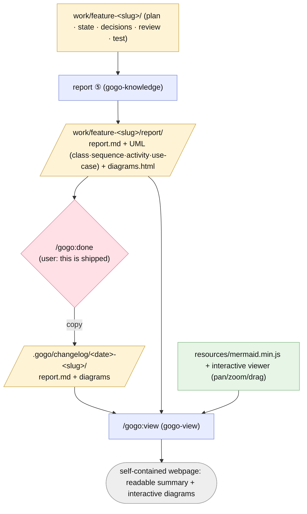

# Plan — Workspace rename, richer report, changelog + interactive viewer

Status: **done** (2026-06-30). Accepted (user, 2026-06-30) — staged (3 stages); D1–D7 as recommended (D3 = pan/zoom/drag canvas); FR12 added mid-build.

## As-built outcome
- **Shipped as planned** — FR1–FR11 + the mid-build **FR12**. `.gogo/plans`→`.gogo/work`,
  `.assets`→`.gogo/resources` (with `gogo-build` auto-migration); the richer
  `report/` bundle (Implementation + Decisions-and-rationale + diff-chosen UML incl.
  the new **`use-case`** kind); `.gogo/changelog/` + **`/gogo:done`**; the
  **`/gogo:view`** offline interactive viewer (pan/zoom/drag); `/gogo:report`
  **lenient mode** for past/broken runs. Command set → **12**; version **0.4.0 → 0.5.0**.
  Working tree **uncommitted** (release pending).
- **Review APPROVE** (REV-001..009 verified across 4 rounds); **Test GREEN**
  (TEST-001..004 verified). Strict/lenient gating confirmed safe; enumerations in sync.
- **Pending:** the gogo logo (awaiting the file) and the 0.5.0 release (commit/tag).
- Full write-up: [report/report.md](./report/report.md). Diagrams: [report/diagrams.html](./report/diagrams.html).

## Goal
A set of related upgrades to gogo's workspace, reporting, and diagram experience:

1. **Rename `.gogo/plans` → `.gogo/work`** (the feature workspace).
2. **Move + rename the vendored runtime** `.gogo/plans/.assets/` → **`.gogo/resources/`**
   (up to the `.gogo/` level so multiple skills can share it).
3. **Richer report ⑤** — `report.md` captures *what was implemented*, *the decisions
   made during implementation and why*, and a **UML set chosen by what changed**
   (sequence / activity / use-case / class, plus flow). Report writes into a
   `report/` subfolder of the feature.
4. **`.gogo/changelog/` + a new `/gogo:done`** — when the user declares a feature
   shipped, copy its `report.md` + diagrams into an append-only `.gogo/changelog/`.
5. **`/gogo:view`** — a new command + skill that lists reports (from
   `.gogo/changelog/` and `.gogo/work/*/report/`), lets the user pick, and opens a
   **self-contained interactive webpage**: the summary rendered readably, and the
   mermaid diagrams **custom-rendered with pan/zoom/drag** (nicer + more usable
   than static CLI output — inspired by xplan's custom SVG canvas).
6. **Docs + the Pages site updated** to reflect all of the above.

## Context — what exists today
- **Feature workspace** is `.gogo/plans/feature-<slug>/`; the path is referenced in
  ~20 plugin files (every command, most skills, `agents/gogo.md`, templates,
  `templates/contracts/*`, README, `docs/*`). `report.md` currently sits at the
  feature-folder **root**; charts in `charts/`.
- **Vendored mermaid runtime** lives at `.gogo/plans/.assets/mermaid.min.js` (one
  per project); every feature's `charts/diagrams.html` loads it via
  `../../.assets/mermaid.min.js`. `gogo-mermaid` (skill) creates/copies it and
  builds the offline viewer from `assets/mermaid/viewer.template.html`.
- **Report ⑤** (`gogo-knowledge`) already: finalizes `plan.md`, draws an as-built
  set via `gogo-mermaid`, writes `report.md`, updates gogo-owned knowledge, writes
  `report/result.json`. The chart **kinds enum** (`charts-manifest.schema.json`) is
  `{flow, sequence, class, activity}` — **no `use-case`**.
- **Diagrams today** are static mermaid (offline `diagrams.html` renders them, but
  with no pan/zoom/drag). **xplan** (reference) renders diagrams with a *custom SVG
  canvas* + a `useCanvasViewport` pan/zoom hook + minimap/controls — it bypasses
  mermaid for display. gogo will keep authoring mermaid but add a custom
  interactive layer over the rendered SVG.
- **Constraints** (`.gogo/knowledge/`): core stays **dependency-free** / **no local
  build**; mermaid is **vendored**, renders offline over `file://`; only ever write
  under `.gogo/`; keep every enumeration in sync; bump `plugin.json` on change.

## Functional requirements

### Stage 1 — workspace + resources refactor (mechanical; lands first)
- **FR1 — `.gogo/plans` → `.gogo/work`.** Update every plugin reference (commands,
  skills, `agents/gogo.md`, templates incl. `state.template.md` file-list +
  `templates/contracts/*` descriptions, README, `docs/*`). The feature folder is
  now `.gogo/work/feature-<slug>/`. No behaviour change beyond the path.
- **FR2 — `.gogo/plans/.assets/` → `.gogo/resources/`.** The vendored runtime moves
  up to `.gogo/resources/mermaid.min.js`. `gogo-mermaid` copies there; the offline
  viewer's `<script src>` becomes `../../../resources/mermaid.min.js` (charts are now
  one level deeper: `.gogo/work/feature-<slug>/charts/`). Update the viewer template,
  `gogo-mermaid`, and the NFR footprint note.
- **FR3 — Migration for existing projects.** `/gogo:build` detects a legacy
  `.gogo/plans/` and/or `.gogo/plans/.assets/` and migrates to `.gogo/work/` +
  `.gogo/resources/` — **move, never delete**; idempotent; logged in the build
  report. (gogo only writes under `.gogo/`, so this stays in-bounds.)

### Stage 2 — richer report + UML + changelog + done
- **FR4 — Report writes to a `report/` subfolder.** `report.md` moves from the
  feature root to `.gogo/work/feature-<slug>/report/report.md`; the as-built UML set
  + an offline `diagrams.html` go in `report/` too (alongside the existing
  `report/result.json`). Update the feature-folder enumerations.
- **FR5 — Report content = implementation + decisions + reasons.** `report.md`
  states what was actually implemented, the **decisions made during implementation
  and the reason for each** (reconciled from `decisions.md` + the implement rounds),
  planned-vs-shipped, and the review/test outcomes.
- **FR6 — UML set chosen by what changed.** From **{sequence, activity, use-case,
  class}** (plus flow), draw the kinds the diff warrants: new types → **class**; new
  runtime interaction → **sequence**; new states/action flow → **activity**; new
  user-facing capability → **use-case**. Extend `charts-manifest.schema.json` kind
  enum to add **`use-case`** (mermaid has no native use-case type → render as a
  flowchart actor↔use-case graph; document this in `gogo-mermaid`).
- **FR7 — `.gogo/changelog/` + `/gogo:done`.** New command `/gogo:done [feature]`
  (thin → a `gogo-knowledge`/new skill step): when the user declares the feature
  shipped, copy `report/report.md` + its diagrams into
  `.gogo/changelog/<YYYY-MM-DD>-<slug>/` (append-only archive), and set `state.md`
  to a terminal **shipped** status. Idempotent; only copies (the work folder stays
  the working source).

### Stage 3 — interactive diagram viewer
- **FR8 — `/gogo:view` command + `gogo-view` skill.** Lists selectable reports from
  `.gogo/changelog/*` and `.gogo/work/feature-*/report/`; the user picks one (or
  more); the skill builds a self-contained webpage and opens it
  (`open`/`xdg-open`, best-effort, with a printed path fallback).
- **FR9 — Readable summary + custom-rendered interactive diagrams.** The page
  renders the chosen `report.md` as clean, readable HTML and renders its mermaid
  diagrams client-side (vendored `.gogo/resources/mermaid.min.js`) wrapped in a
  **custom pan / zoom / drag-canvas / reset / fit** layer (vanilla JS, adapted from
  xplan's viewport approach) — markedly better than the static CLI/PNG output.
  (Per-node repositioning is a **stretch**, see D3.) The reusable interactive
  renderer (JS/CSS/template) is vendored in the plugin `assets/` and copied to
  `.gogo/resources/`.
- **FR10 — Offline + portable.** The viewer opens over `file://` with no network /
  no build, using only vendored assets; degrades gracefully (prints the path if it
  can't auto-open).

### Cross-cutting
- **FR11 — Docs + Pages + version.** Update `docs/*` + the Pages site (architecture
  file map → `.gogo/work`, `.gogo/resources`, `report/`, `.gogo/changelog`; commands
  page → `done`, `view`; flow/discovery as needed) and README; bump `plugin.json`
  `0.4.0 → 0.5.0`; sync every enumeration (now **12** commands).
- **FR12 — `/gogo:report` on past/broken runs + `/gogo:done` guidance** (added
  2026-06-30, see `adjustments.md`). `/gogo:report <feature>` (the existing
  standalone phase ⑤) gains a **lenient mode**: when a feature is a past/broken/
  incomplete run (not cleanly green), it still produces a best-effort
  `report/report.md` synthesized from whatever exists in `.gogo/work/<feature>/`
  (plan, decisions, review/issues, test/issues, state, charts), and **clearly marks
  which phases completed and what is missing/open** instead of refusing. The
  in-pipeline ⑤ call (after a green ④) keeps its strict validate-in gate.
  `/gogo:done` already STOPs when `report/report.md` is absent; its message must
  tell the user to run **`/gogo:report <feature>` first**.

## Approach (recommended)
Deliver in **three stages under one feature** (D1), each its own
implement→review→test loop, lowest-risk first:

1. **Stage 1 (mechanical):** global path rename + the resources move + build-time
   migration. Pure find/replace + the `gogo-mermaid`/viewer path math + a migration
   step in `gogo-build`. Validate nothing else drifts.
2. **Stage 2 (report/changelog):** `report/` subfolder + richer `report.md` +
   the chosen-by-diff UML set (+ `use-case` enum) + `.gogo/changelog/` + `/gogo:done`.
3. **Stage 3 (viewer):** vendor the interactive renderer (pan/zoom/drag) in
   `assets/`; add `/gogo:view` + the `gogo-view` skill that builds + opens the page.
4. **Docs + version** updated as each stage lands (final sweep at the end).

### Alternatives considered
- **Structured node/edge model + a full custom renderer like xplan** — *rejected*:
  xplan stores diagrams as nodes+edges and renders without mermaid; porting gogo to
  that is a huge change. gogo keeps authoring mermaid and adds an interactivity
  layer over the rendered SVG — far smaller, preserves the offline viewer.
- **A served web app / React Flow viewer** — *rejected*: needs a build + deps +
  a server; breaks the no-build / offline / zero-dep bar. Vanilla JS over `file://`
  keeps portability.
- **Auto-archive to changelog at report ⑤** (no `/gogo:done`) — *rejected*: the user
  wants an explicit "this is the end" gate; `report` finalizes in the work folder,
  `done` promotes to the changelog.
- **Keep `.assets` name / under `plans`** — *rejected per the goal*: a shared
  `.gogo/resources/` is the home the viewer + future skills need.

## Open decisions (recommendations — see `decisions.md`)
- **D1 — Staging.** One feature, **three stages** (mechanical → report/changelog →
  viewer), each looped + shippable. **Rec: staged** (vs one big bang).
- **D2 — Existing-project migration.** `/gogo:build` **auto-migrates** legacy
  `.gogo/plans`→`.gogo/work` + `.assets`→`.gogo/resources` (move, log), vs a
  documented manual `mv`. **Rec: auto-migrate** (idempotent, in-bounds).
- **D3 — Viewer interactivity.** **A.** canvas pan + zoom + drag + reset/fit now;
  per-node repositioning a later stretch. **B.** full per-node drag + edge re-route
  now (much larger over mermaid SVG). **Rec: A.**
- **D4 — Use-case diagrams.** mermaid has no native use-case type → render as a
  flowchart actor↔use-case graph and add `use-case` to the chart-kind enum.
  **Rec: yes** (so "use case when relevant" is expressible).
- **D5 — Changelog entry naming.** `.gogo/changelog/<YYYY-MM-DD>-<slug>/` (dated,
  ordered) vs plain `<slug>/`. **Rec: dated.**
- **D6 — Report layout move.** Consolidate report.md + diagrams under
  `report/` (vs leaving `report.md` at the feature root). **Rec: under `report/`.**
- **D7 — Viewer summary rendering.** The `gogo-view` skill **pre-renders** the
  report.md summary to HTML (zero extra dep) vs vendoring a JS markdown lib.
  **Rec: pre-render** (keeps the offline/zero-dep bar; mermaid stays client-side).

## Changes checklist (build order)
**Stage 1**
1. Global rename `.gogo/plans` → `.gogo/work` across commands/skills/agents/
   templates/`contracts`/README/docs (grep-driven; FR1).
2. `gogo-mermaid` + `assets/mermaid/viewer.template.html` + NFR note: runtime at
   `.gogo/resources/mermaid.min.js`; viewer `<script src>` path math (FR2).
3. `gogo-build` Step: migrate legacy `.gogo/plans`/`.assets` → `.gogo/work`/
   `.gogo/resources` (FR3).

**Stage 2**
4. `charts-manifest.schema.json` — add `use-case` to the kind enum; `gogo-mermaid` —
   use-case guidance + the chosen-by-diff rules (FR6).
5. `gogo-knowledge` + `templates/report.template.md` — write to `report/`, richer
   content (impl + decisions + reasons), the UML set (FR4/FR5/FR6); update
   `state.template.md` feature-folder file list.
6. `commands/done.md` (new, thin) + `gogo-knowledge` (or a small `gogo-done` step):
   `.gogo/changelog/<date>-<slug>/` copy + terminal state (FR7).

**Stage 3**
7. `assets/viewer/` (new) — vendored interactive renderer: pan/zoom/drag JS + CSS +
   page template (FR9).
8. `skills/gogo-view/SKILL.md` (new) + `commands/view.md` (new, thin): enumerate
   reports, pick, build the page into `.gogo/resources/` (or the report folder),
   open it (FR8/FR9/FR10).

**Cross-cutting**
9. `docs/*` + Pages site + README + `.claude-plugin/plugin.json` (0.4.0 → 0.5.0);
   enumeration sync (12 commands) (FR11).

## Tests (how we'll verify — see `test-strategy.md`)
- **Stage 1:** grep shows **zero** stale `.gogo/plans` / `.assets` references in
  plugin source; a feature's `charts/diagrams.html` resolves the new
  `../../../resources/mermaid.min.js` (offline render still works); `gogo-build`
  migrates a fixture with a legacy `.gogo/plans/`/`.assets/` to `.gogo/work/`/
  `.gogo/resources/` (idempotent; content preserved).
- **Stage 2:** report ⑤ on a fixture writes `report/report.md` (with an
  implementation + decisions-and-reasons section) + the diff-appropriate UML set;
  `charts-manifest.schema.json` accepts `use-case` and rejects unknown kinds;
  `/gogo:done` copies report.md + diagrams to `.gogo/changelog/<date>-<slug>/` and
  sets terminal state; re-run is idempotent.
- **Stage 3:** `/gogo:view` lists changelog + work reports; building a page for a
  pick produces a self-contained HTML that renders the summary + diagrams and
  exposes working pan/zoom/drag/reset; it opens over `file://` with no network;
  graceful path-fallback when auto-open is unavailable.
- **Cross-cutting:** docs/site enumerate `done` + `view` and the new layout; version
  bumped; all JSON artifacts still validate.

## Out of scope
- A structured node/edge diagram model or a full graph editor (xplan-style); editing
  or persisting diagram layouts.
- A served/hosted viewer or any build step / runtime dependency.
- Versioned docs; multi-feature changelog rollups beyond per-feature entries.
- Changing the pipeline phases, the contract shapes (beyond the `use-case` enum), or
  `/gogo:skills`.

## Diagrams (intended design)
The new artifact flow — work → report (`report/`) → `gogo:done` → changelog, and
`gogo:view` building the interactive page from the vendored resources. Also at
`charts/artifact-flow.mmd`; viewer `charts/diagrams.html`.

