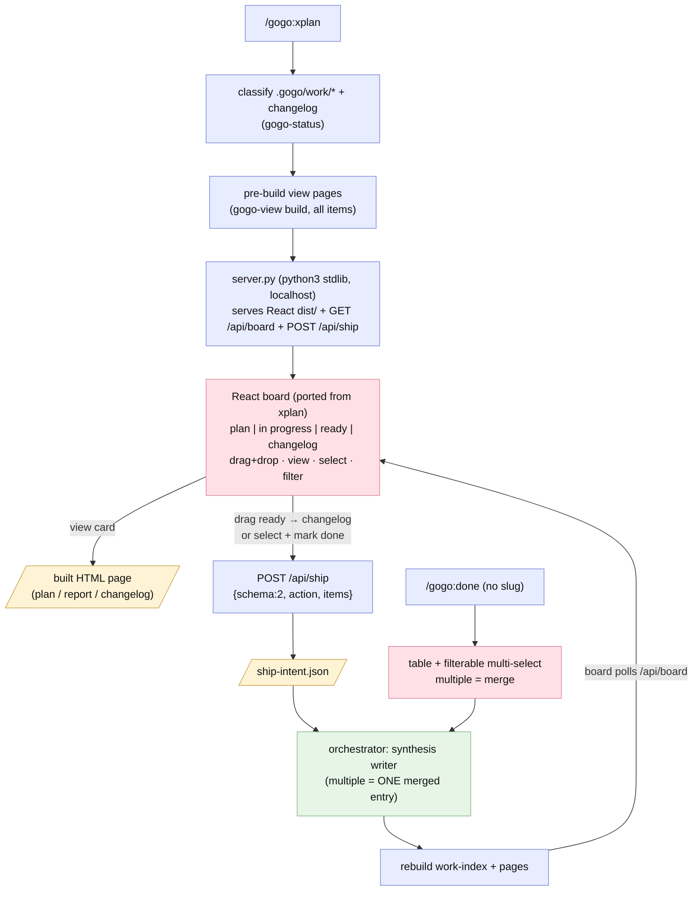

# Plan — feature `xplan-board-and-simple-done`

Status: **built — report-complete** (phase ⑤, 2026-07-02 · shipped in plugin **0.10.0**). **The intended design held as built** — all four accepted recommendations (D1=A commit + tag v0.9.0 first, this feature = 0.10.0 · D2=A long-running server + polling live refresh · D3=A pre-build all pages at launch · D4=A committed `dist/`, npm dev-time only) landed as planned; the one mid-plan pivot was the user's own relaxation from a vanilla-JS board to a **full React+Vite port** of xplan's board ([adjustments.md](adjustments.md)). Three implement rounds (Stage A · Stage B · the review-fix batch) drew **8 findings total (7 review + 1 test), all minor/nit, all fixed and verified** — the only post-plan behavioural addition was D5: Host-allowlist + Origin hardening on `server.py` (review's REV-007, resolved harden). As-built report: [report/report.md](report/report.md).

## Goal

Replace the terminal kanban with the browser. The 0.9.0 tmux cockpit failed its first real user test (the detached-session + attach dance never connected), so: **remove the TUI entirely**, make the terminal surfaces **simple filterable lists**, and add **`/gogo:xplan`** — an xplan-style **kanban board in the browser** where the work actually is: four columns (**plan · in progress · ready · changelog**), drag-and-drop, open any item's HTML page, and mark ready items done (**multiple picks = one merged changelog entry**).

## Context — what exists

- **The 0.9.0 TUI to remove:** `assets/kanban/board.py` (curses selector) + the tmux launch / `board-intent.json` / relaunch-loop machinery in `skills/gogo-done/SKILL.md` (~26 references). The **intent concept survives** — it just moves from curses+tmux to browser+HTTP.
- **The shared classifier** (`skills/gogo-status/SKILL.md`) — unchanged; its four classes map 1:1 to the board columns (unfinished→**plan**, in-progress, ready-to-ship→**ready**, shipped→**changelog**).
- **The 0.8.0 synthesis writer** in `gogo-done` ("Write changelog entry, 1..N members") — unchanged; both the list and the board route into it.
- **`gogo-view`** — already builds every page the board needs (`<slug>:plan`, `<slug>:report`, `<date>-<name>`).
- **xplan's board is a near-ideal port** (explored at ~/repos/xplan): the whole UI is one file (`web/src/screens/ScreenTasks.tsx` — `BoardColumns` :448, `Card` :511, `LabelChip` :43); **DnD is native HTML5** (draggable + one `dragId` + column `onDragOver`/`onDrop` — no library); styling is the `TONE` palette (`web/src/styles/tokens.ts`: bg `#141518`, surface `#1c1d21`, border `#2a2c32`, text `#dcdde0`, muted `#71747c`, done `#5db97a`, in-progress `#e6a14a`, accent `#7aa8ff`) already mirrored as `:root` CSS vars in `global.css` (`.wf-panel` card shell, 268px flex columns); data model is flat `{columns[], issues[]}`. The React `ui/*` primitives are small/style-only; the GitHub half and Mongo persistence get dropped entirely.

## Functional requirements

### Stage A — terminal simplification (remove the TUI)
- **FR1 — remove the tmux/TUI path.** Delete `assets/kanban/board.py` and all tmux launch / intent-file / relaunch machinery from `gogo-done`; drop `.gogo/resources/kanban/` from docs. The classifier and the synthesis writer stay.
- **FR2 — `/gogo:done` = a filterable multi-select list.** No slug → print the classified table (all four classes for context), then offer the **ready-to-ship** items as an `AskUserQuestion` **multi-select**. **Selecting multiple = merge into ONE changelog entry** (release-name suggest+confirm) — no separate-vs-merged question, that gate is removed. One pick = one entry. More ready items than fit → ask a **text filter** first (also: a non-slug arg is treated as a filter, `<slug>` and `a+b+c` args keep working).
- **FR3 — `/gogo:view` filter.** The grouped picker gains the same text filter: a non-resolving arg filters the enumerated list; >4 matches → filter question first.

### Stage B — `/gogo:xplan`, the browser board (13th command)
- **FR4 — the board app (React port of xplan's board).** New `assets/xplan-board/`: a **React+Vite app** porting xplan's actual board (`ScreenTasks`-derived `BoardColumns`/`Card`/`LabelChip`, the `TONE` dark palette + `.wf-panel` shell, 268px flex columns, native HTML5 drag-drop, the small `ui/*` primitives it needs), adapted to gogo's model and extended with a **text filter input** in the toolbar. Columns fixed: **plan · in progress · ready · changelog**; items come from the shared classifier (+ changelog entries); reactive updates via the poll of `GET /api/board`. No card create/edit/delete, no GitHub half, no Mongo. **npm/node is a dev-time dependency only**: the app source lives in the plugin AND the built `dist/` is committed, so plugin users need no npm at runtime (D4=A); gogo devs rebuild (`npm install && npm run build`) when the board changes.
- **FR5 — view from the board.** Every card has **view** → opens its built page (plan page for plan/in-progress, work report for ready, changelog entry for shipped). `/gogo:xplan` **pre-builds all pages at launch** (gogo-view build) so the server serves them statically.
- **FR6 — mark done from the board.** Select one or a few **ready** cards (checkbox), or **drag a ready card → the changelog column** (dragging a selected card takes the whole selection): the board POSTs `{"schema":2,"action":"ship-merged"|"ship","items":[...]}` — same intent shape as 0.9.0, new transport. Multiple = **one merged entry** (consistent with FR2). Illegal drags (any other column move) bounce with a hint — columns are derived state.
- **FR7 — the local server + live refresh.** `assets/xplan-board/server.py`: **python3 stdlib only** (`http.server` + `json`), **localhost-only**, serves the board assets + `GET /api/board` (the work-index) + `POST /api/ship` (writes `ship-intent.json`, responds 202). The orchestrator watches for the intent (background wait), runs the **synthesis writer**, rebuilds the work-index + pages, and the board (polling `GET /api/board` every few seconds) re-renders — the shipped card **moves to the changelog column live**. `python3` stays a **soft dep**: absent → say so, point at `/gogo:done`'s list (no board, no hard failure). Server shuts down on `q`/Ctrl-C in chat or when the user closes it.
- **FR8 — sync + version.** New `commands/xplan.md` (+ `skills/gogo-xplan/SKILL.md`); command count **12 → 13** everywhere it's stated; docs/README sweep (remove all TUI/cockpit wording, add the board + simplified lists); `test-strategy.md` TUI section retired at ⑤; `plugin.json` → **0.10.0**.

## Approach (recommended)

**Same intent protocol, better surface.** The 0.9.0 architecture was right about one thing: the selector emits intents, the orchestrator executes them. What failed was the *surface* (curses in tmux, unreachable from a plain terminal). Stage B keeps the schema-v2 intent + the classifier + the writer, and swaps the transport: a **real React board** (xplan's own components, ported) → tiny stdlib server → intent file → orchestrator. The React app is plugin **source with a committed `dist/`** — devs get npm and components, users get a folder of static files served by python3. Stage A makes the no-browser path honest: a plain list where multi-select **is** the merge signal — one question, zero ceremony.

*Alternatives considered:* a vanilla-JS re-write of the board (superseded mid-plan — the user allows a full npm/React build, and porting xplan's real components is both nicer and more faithful); requiring npm at **runtime** (rejected: `dist/` committed keeps plugin users at python3-only, npm stays dev-time — D4); a static `file://` board without mark-done (rejected: the user explicitly wants ship-from-board; `file://` can't POST); a node/Fastify runtime server (rejected: `dist/` is static — python3 stdlib serves it + the two API routes, one soft dep instead of two); keeping a slimmed TUI alongside (rejected: the user said remove it — one board, one list).

## Changes checklist (build order)

**Stage A**
1. `skills/gogo-done/SKILL.md` — strip TUI/tmux/intent-loop; board mode → table + filterable multi-select; multiple=merge (gate removed); keep `<slug>` / `a+b+c` args + the writer untouched.
2. Delete `assets/kanban/` (board.py).
3. `skills/gogo-view/SKILL.md` — filter for the picker.
4. `commands/done.md`, `commands/view.md` — thin sync.

**Stage B**
5. `assets/xplan-board/` — the React+Vite app (`package.json`, `src/` ported from xplan's `ScreenTasks`/tokens/ui primitives, adapted board model + filter + polling) + committed `dist/` build + `server.py` (stdlib, localhost, serves `dist/` + `/api/board` + `/api/ship`).
6. `skills/gogo-xplan/SKILL.md` + `commands/xplan.md` — classify → pre-build pages → start server → open browser → watch intent → ship (writer) → rebuild index; degradation (no python3 / port busy / browser won't open).
7. `skills/gogo/SKILL.md`, `README.md`, `docs/{index,commands,flow,architecture}.md` — 13 commands, board + lists wording.
8. `.claude-plugin/plugin.json` — **0.10.0**.

## Tests

- **Stage A:** dogfood the list flow in a scratch fixture (multi-pick → ONE merged entry via the writer; single pick → one entry; filter narrows; `a+b+c` arg still merges); grep: zero tmux/board.py/board-intent references left in product files.
- **Stage B:** `npm run build` green (dev-time; dist/ committed and in sync with src/); `server.py --selftest` (request routing, intent write, guard: only ready slugs shippable); live: start server on a fixture, `curl /api/board` + `POST /api/ship` → intent file appears, 202; **Playwright MCP** drives the real React board — columns render from the index, filter narrows, view opens a page, drag ready→changelog fires the POST, card moves after index refresh; illegal drag bounces. `py_compile` + server ASCII/stdlib checks.
- **FR8 sweep:** 0.10.0, **13** commands everywhere, no stale TUI/cockpit/tmux wording, changelog-entry + members[] semantics unchanged (0.8.0 regression guard).

## Out of scope

- Card create/edit/delete, GitHub import, SSE (polling is enough), reorder-within-column (xplan doesn't have it either), multi-project boards (roadmap #9), auth (localhost only).
- Retro-changes to shipped changelog entries.

## Intended design

> **As built (report ⑤, 2026-07-02):** the intended design held — the shipped flow matches
> this diagram (the board node updated mid-plan from "vanilla port" to the React board per
> [adjustments.md](adjustments.md); `server.py` additionally gained the D5 Host/Origin
> hardening). The as-built set (this flow + a ship-from-board sequence diagram) lives in
> `report/` with the before baseline (the 0.9.0 TUI cockpit) in `report/before/`.

