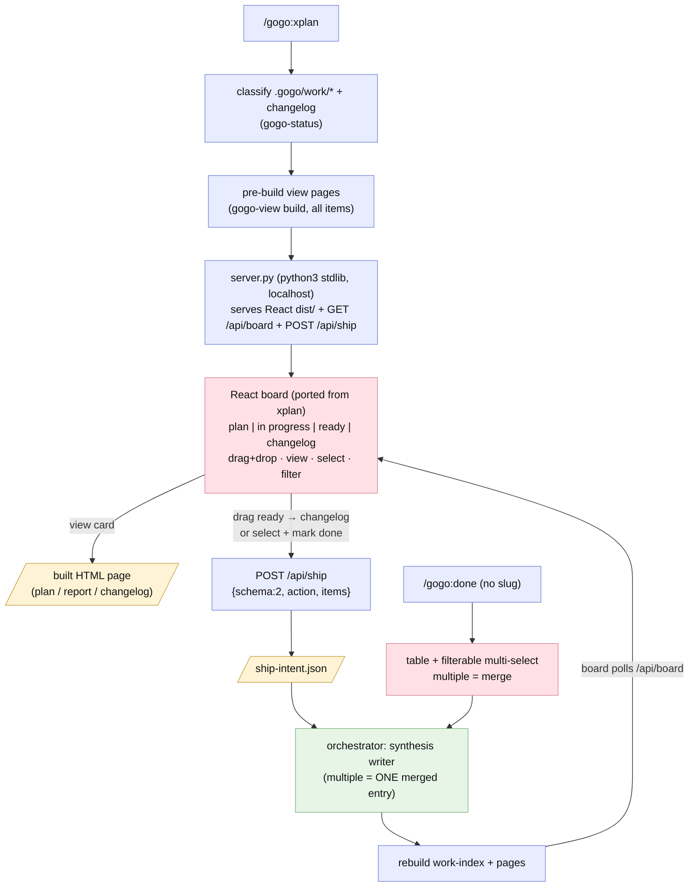
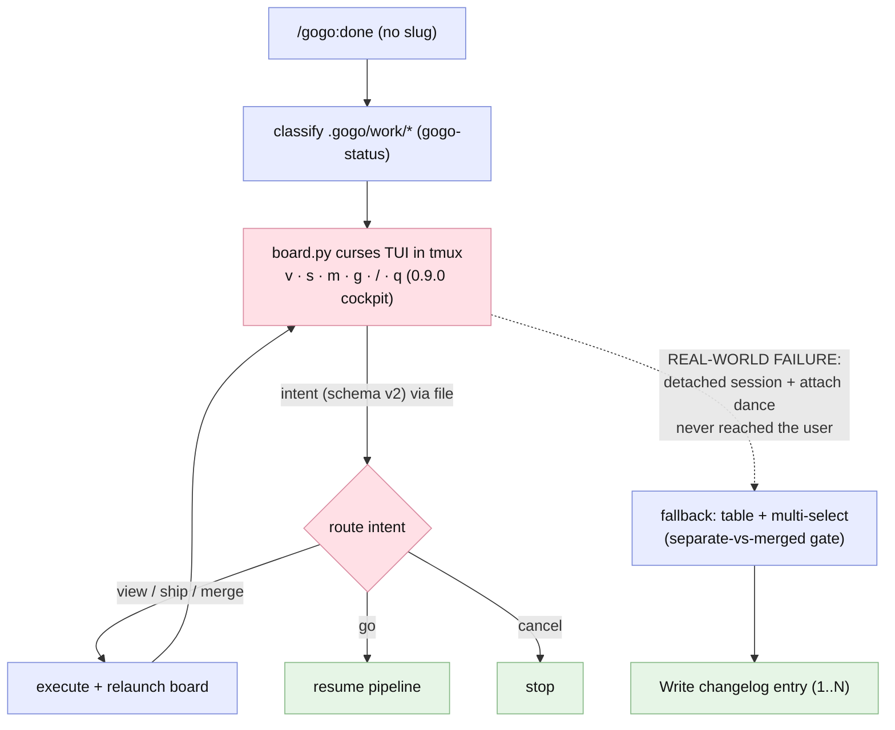

# Report — feature `xplan-board-and-simple-done`

- **feature:** `/gogo:xplan` browser kanban (React port of xplan) + simple filterable `/gogo:done` / `/gogo:view` lists · TUI removed
- **status:** done
- **completed:** 2026-07-02
- **branch / commits:** `main` · on top of `47d872f` (v0.9.0, tagged + pushed per D1) · working-tree change, ships as plugin **0.10.0**

## Run status / gaps

**All five phases completed cleanly; zero open issues.** Plan → implement → review → test → report ran with plan=1 · implement=3 · review=2 · test=1 rounds. All **8 findings (7 review + 1 test) were minor or nit — no blockers, no majors — and every one is fixed and verified**: Stage A's two review findings were fixed before Stage B, Stage B's five in implement round 3 and re-verified live by test round 1, and the single test nit (TEST-001) was fixed inline and verified in the same round. This is a clean green release.

## Summary

**The kanban board moved to the browser, where it belongs — and the terminal became honest lists.** The 0.9.0 tmux/curses cockpit failed its first real user test (the detached-session + attach dance never reached the user), so **0.10.0 removes the TUI entirely** and replaces both halves of it: `/gogo:done` and `/gogo:view` are now plain **filterable pickers** in chat (multi-select **is** the merge signal — no extra question), and the new 13th command **`/gogo:xplan`** hosts a real **React kanban board ported from xplan** — four live columns (plan · in progress · ready · changelog), drag-and-drop, per-card view pages, and ship-from-board — served by a hardened pure-stdlib localhost server. The failed TUI experiment is the origin story, not a loose end: per D1 it was committed and tagged as v0.9.0 first (its history stays truthful in a frame), then removed as one clean diff. What survived it is the architecture that was right all along — **the surface emits schema-v2 intents, the orchestrator executes them** with the untouched 0.8.0 synthesis writer; only the transport changed from curses+tmux to browser+HTTP.

## Planned vs shipped

**Shipped as accepted — the intended design held.** All four decisions landed exactly as recommended (v0.9.0 committed first; long-running server + polling refresh; pages pre-built at launch; committed `dist/` with npm dev-time only). Two deltas, both recorded:

- **The React pivot happened mid-plan, not post-plan** — the user relaxed the "vanilla JS" constraint before acceptance ("we have npm install… so it can be normal npm full react build"), so FR4 became a port of xplan's actual board components rather than a re-write ([adjustments.md](../adjustments.md)).
- **D5 hardening was added in review** — review flagged the missing Host/Origin validation as a conscious residual (REV-007); resolution was **harden**: a Host allowlist + Origin check (~10 stdlib lines) that is not the auth the plan scoped out ([decisions.md](../decisions.md)).

## Implementation

**Stage A made the no-browser path honest.** `skills/gogo-done/SKILL.md` was stripped of all tmux/TUI/intent-loop machinery and rebuilt around one flow: classified four-class table → text filter (**loops until the list fits one question**, REV-002) → `AskUserQuestion` multi-select where **picking several means ONE merged changelog entry** — the 0.8.0/0.9.0 separate-vs-merged gate is gone. A `+`-joined arg is **authoritative** (any unknown part → STOP, never a filter, REV-001); only a bare non-resolving arg filters. `assets/kanban/board.py` was deleted; `/gogo:view`'s grouped picker gained the same looping filter; the 0.8.0 synthesis writer stayed **byte-identical** (verified against `47d872f` in both review rounds).

**Stage B put the board in the browser.** `assets/xplan-board/` holds a React+Vite app ported from xplan's own board — TONE palette tokens verbatim, `.wf-panel` card shell, 268px flex columns, native HTML5 drag-and-drop — adapted to gogo's model: four fixed columns fed by `GET /api/board` (polled ~3s, paused while dragging), a live text filter, per-card **view** links to pre-built pages, ready-card checkboxes + a "Mark done (N) → one merged entry" footer, drag ready→changelog to ship, illegal drags bounce with a hint, and a full toast lifecycle (persistent "shipping…" info, non-202 error toasts, a ~3-min watchdog against a wedged ship). The **`dist/` is committed** so plugin users need no npm (D4). `server.py` is pure stdlib, pure ASCII, **127.0.0.1-only** with a **Host allowlist + Origin check** (D5), path-traversal-safe static serving, a ready-only + schema guard on `POST /api/ship`, **atomic race-free intent writes** (unique tmp + `O_CREAT|O_EXCL`, REV-006), 202/400/403/409 semantics, and a `--selftest`. `skills/gogo-xplan/SKILL.md` orchestrates: classify → write `board.json` → pre-build all pages (gogo-view) → serve + open → **watch the intent → gogo-done writer → rebuild → the polling board moves the card live**. The FR8 sweep landed 13 commands, 0.10.0, and zero stale TUI wording anywhere on the product surface.

### Changes (as-built)

| File | Change | Note |
|---|---|---|
| `assets/kanban/board.py` | **removed** | the 0.9.0 curses TUI + all tmux launch/relaunch machinery — gone entirely |
| `skills/gogo-done/SKILL.md` | rewritten (list mode) | table → looping filter → multi-select; multiple = ONE merged entry (gate removed); `+` arg authoritative; writer untouched |
| `skills/gogo-view/SKILL.md`, `commands/done.md`, `commands/view.md` | modified | the same looping text filter for the grouped picker; thin command sync |
| `assets/xplan-board/src/*`, `package.json`, `vite.config.ts`, `index.html` | **added** | the React+Vite board ported from xplan (TONE tokens, `.wf-panel`, native DnD, polling, filter, toasts + watchdog) |
| `assets/xplan-board/dist/` | **added (committed)** | the built board — plugin users need python3 only; npm/node is dev-time (D4) |
| `assets/xplan-board/server.py` | **added** | stdlib localhost server: static `dist/` + `/view/*`, `GET /api/board`, `POST /api/ship`; Host/Origin + ready-only + traversal guards, atomic intents, `--selftest` |
| `skills/gogo-xplan/SKILL.md`, `commands/xplan.md` | **added** | the 13th command: classify → board.json → pre-build → serve → watch-loop → writer → live refresh; full degradation table |
| `skills/gogo/SKILL.md`, `skills/gogo-status/SKILL.md`, `README.md`, `docs/{index,commands,flow,architecture}.md`, `.gitignore` | modified | FR8 sweep — 13 commands, board + lists wording, zero TUI residue |
| `.gogo/knowledge/{tech-stack,coding-rules,non-functional-requirements,test-strategy,testing-tools,project-knowledge}.md` | modified | TUI-era falsehoods fixed in-flight (REV-005) + reconciled at ⑤ (below) |
| `.claude-plugin/plugin.json` | modified | version → **0.10.0** |
| 0.8.0 synthesis writer + shipped changelog entries | untouched | byte-identical to `47d872f`; both surfaces route into it |

## Decisions & rationale

See [decisions.md](../decisions.md) for the full record.

| Decision | Choice | Reason |
|---|---|---|
| D1 — release hygiene | **A: commit + tag v0.9.0 first**, this feature = 0.10.0 (done: `47d872f`, tag pushed) | the TUI's history stays in a frame; its removal is one clean diff |
| D2 — server lifetime | **A: long-running server + polling board** | the whole point of the browser surface is staying open — multiple ships per session, live feedback |
| D3 — page pre-build | **A: pre-build all pages at launch** | the server stays static/dumb (stdlib); view buttons always work offline |
| D4 — React build location | **A: source + committed `dist/`, npm dev-time only** | plugin users keep the single python3 soft dep; no install step at use time |
| D5 — Host/Origin residual (from REV-007) | **harden** — Host allowlist + Origin check | ~10 stdlib lines, not the auth the plan scoped out, zero UX cost, closes DNS-rebind/CSRF |
| Non-forks (user-stated) | multiple picks = ONE merged entry (list AND board); TUI removed entirely; columns = the four classifier classes; the command is `/gogo:xplan` | verbatim direction from the origin request ([adjustments.md](../adjustments.md)) |

## Review outcome

**Two rounds, both APPROVE, seven findings — all minor/nit, all fixed and verified.** [Round 1](../review/review-01.md) (Stage A) found two minors in the new list grammar: a partial `+`-merge silently degrading to an empty filter (REV-001) and a filter that narrowed only once (REV-002) — both fixed before Stage B and re-verified in round 2. [Round 2](../review/review-02.md) (Stage B) called `server.py`'s security posture **STRONG** (localhost-only, traversal probes contained live, ready-only guard, atomic writes) and the app↔server↔skill contract consistent, raising five: a dead `version` chip (REV-003), a ship with no timeout wedging the toast (REV-004 → the watchdog), TUI residue in two dogfood knowledge files (REV-005), a non-triggerable POST TOCTOU (REV-006 → `O_CREAT|O_EXCL`), and the Host/Origin residual (REV-007 → **hardened per D5**, the round's one real security improvement). All five fixed in implement round 3, dist rebuilt, and every fix re-verified live in test round 1. See [review/issues.json](../review/issues.json).

## Test outcome

**GREEN — and the first full Playwright-driven board test in this repo.** [Test round 1](../test-01.md) ran three levels. **API/server:** a 25+-check live matrix — routing, the whole `POST /api/ship` truth table (202 valid single + merged / 400 non-ready, bad shape, bad JSON, empty / 409 pending), the D5 guards (evil `Host` → 403 on all verbs; evil `Origin` → 403 with no intent written), six raw-socket traversal probes all contained, SIGTERM pid cleanup, `--selftest` exit 0. **UI:** Playwright MCP drove the real React board on a fixture server — four columns render, the filter narrows live, checkbox selection + "Mark done (2) → one merged entry", the full ship loop (POST → 202 → intent file → simulated orchestrator → **card moves to changelog on the next poll**), view links, drag-to-ship, and the illegal-drag guard (no POST fired). **CLI/spec:** the Stage A list semantics (both REV regression guards, multiple=merge) and the FR8 sweeps (0.10.0, 13 commands, writer byte-identical, dist staged / node_modules not). The one finding, **TEST-001** (an illegal-drag hint could clobber the shipping toast, nit), was fixed inline — the hint now yields to an active ship — dist rebuilt (`index-C_LxGwCR.js`) and verified. See [test/issues.json](../test/issues.json).

## Diagrams

Two as-built diagrams (no `diagrams.html` in this bundle — the 0.8.0 slim rule; open them interactively with `/gogo:view xplan-board-and-simple-done`):

- `flow.mmd` — the shipped control flow: classify → pre-build → server → board → intent → writer → rebuild → poll; plus the simplified `/gogo:done` list into the same writer.
- `sequence.mmd` — the ship-from-board runtime interaction, end to end, including the guard/error path and the toast watchdog.



```mermaid
sequenceDiagram
  autonumber
  actor U as User (browser)
  participant B as React board (dist/)
  participant S as server.py (127.0.0.1)
  participant I as ship-intent.json
  participant O as orchestrator (gogo-xplan watch loop)
  participant W as gogo-done synthesis writer
  participant J as board.json

  U->>B: select ready cards / drag ready → changelog
  B->>S: POST /api/ship {schema:2, action, items}
  note over S: guards — Host allowlist + Origin check (D5),<br/>schema v2, ready-only, no intent pending
  alt guard fails
    S-->>B: 400 / 403 / 409 + reason
    B-->>U: error toast (this attempt's slugs cleared)
  else accepted
    S->>I: write intent (unique tmp + O_CREAT|O_EXCL, atomic)
    S-->>B: 202 Accepted
    B-->>U: persistent "shipping N items… waiting for gogo" toast + card tags
    O->>I: watch loop — read + delete intent
    O->>W: ship items (multiple = ONE merged changelog entry)
    W-->>O: .gogo/changelog/&lt;date&gt;-&lt;name&gt;/ written · members → shipped
    O->>J: rebuild board.json (re-classify) + affected pages
    loop every ~3s (paused while dragging)
      B->>S: GET /api/board
      S->>J: re-read per request
      S-->>B: fresh payload
    end
    B-->>U: shipped card moves to the changelog column · toast clears
  end
  note over B: ~3-min watchdog — an unreconciled ship downgrades the stuck<br/>info toast to a dismissible warning; polling continues
```

## Before / after comparison

The plan captured an as-is baseline (copied here as `before/flow.mmd`). **Flow** is present in both sets; **sequence** is added (after only — the browser↔server↔orchestrator ship loop is new runtime interaction worth its own diagram).

**Before** — the 0.9.0 cockpit: architecturally sound (intents + orchestrator execution) but behind a surface that failed in real use — the detached tmux session + attach dance never reached the user, and only the chat fallback worked:



**After** — see the flow diagram above. **What changed:** the curses+tmux surface is gone; the board is a browser page served over HTTP, so it always reaches the user, and the fallback stopped being a fallback — the table + multi-select **is** the terminal path now, with its separate-vs-merged gate removed (multi-select = merge). The intent protocol survived intact (schema-v2 file → orchestrator → the same writer); the relaunch loop became a poll loop, so shipped cards move columns **live** instead of the board restarting; and viewing/shipping gained real affordances (view links, checkboxes, drag) instead of single-letter keys.

## Knowledge updates

- `test-strategy.md` (owned): the deferred full rewrite landed — the TUI-era scaffolding is gone; browser-board testing is now first-class (`server.py --selftest` + the curl matrix + Playwright against a fixture server), and the UI level notes the plugin now has its own browser surface.
- `testing-tools.md` (owned): Playwright MCP is no longer "target projects only" — it also drives the plugin's own `/gogo:xplan` board; the `--selftest` bullet already pointed at `server.py` (REV-005), verified no dangling `board.py` refs.
- `non-functional-requirements.md` (owned): recorded the new **localhost-server bar** learned from D5 — any vendored local HTTP server binds 127.0.0.1 only, enforces a Host allowlist + an Origin check on mutating routes, is path-traversal-safe, and writes intents atomically.
- `tech-stack.md`, `coding-rules.md` (owned): verified current — React+Vite/npm as dev-time tooling, committed-dist convention, and the vendored-executable rules (stdlib, ASCII, `--selftest`, exit contract) were already reconciled in-flight by the FR8 sweep + REV-005.
- `project-knowledge.md` (proxy — overrides only): verified current — the "since 0.10.0" bullet, the 0.9.0 bullet's "REPLACED in 0.10.0" note, 13 commands, version 0.10.0 all in place.

No upstream (README/CLAUDE.md) edits suggested — the README was synced in-scope by FR8.

## Follow-ups & known limitations

- **Plan/decision commenting from the board** (roadmap #7) — the board + intent + watch-loop machinery is exactly the surface a line-by-line plan commenter would build on; unbuilt.
- **prosteKarnety as the first external consumer** — dogfood `/gogo:xplan` on a real target repo to shake out non-gogo work-index shapes.
- **SSE / push refresh** — polling (~3s) is deliberately enough; revisit only if a real board session feels laggy.
- **Card create/edit/delete, GitHub import, reorder-within-column, multi-project boards (roadmap #9), auth** — out of scope by plan; the board is a surface over the classifier + writer, not a task manager.
- `python3` stays a **soft dep**: absent → `/gogo:done`'s filterable list, no board, no failure.
