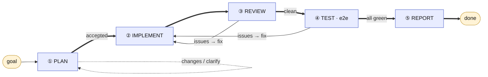

# gogo

**A portable, knowledge-grounded development pipeline for Claude Code.**

> **The flow is generic and ships with the plugin. The rules are yours.**
> gogo runs every non-trivial change through five fixed phases — **plan →
> implement → review → test → report** — but *what* it plans against, *how* it
> writes code, *what* review flags, and *how* it tests are all driven by plain
> markdown **knowledge files** that gogo wires up from your existing project docs.
> Same pipeline everywhere; the behaviour is configuration.

## The flow


<details>
<summary>Same flow as an editable Mermaid diagram</summary>


</details>

*Plan waits for your acceptance before any code is written. Review and test loop
fixes back into implement, and either can **pause for your decision** at any point
— you answer and it resumes. On success, Report updates your knowledge docs.
**Every phase is grounded in your `.gogo/knowledge/` config.***

## Generic flow, your rules

The five phases never change. What changes per project lives in **`.gogo/knowledge/`**
— a set of small markdown files gogo reads at each phase:

| Phase | Reads from `.gogo/knowledge/` |
|---|---|
| ① Plan | `project-knowledge`, `tech-stack`, `non-functional-requirements`, `coding-rules` |
| ② Implement | `coding-rules`, `tech-stack` |
| ③ Review | `code-review-standards`, `coding-rules`, `non-functional-requirements` |
| ④ Test | `testing-tools`, `test-strategy`, `non-functional-requirements`, `tech-stack` |
| ⑤ Report | updates the above (your gogo-owned summaries) |

These files are **proxies**: they link to your project's real docs (an existing
`CLAUDE.md`, `README`, `CONTRIBUTING`, Copilot / Cursor / Windsurf / Codex configs,
manifests, test configs) and add a short gogo-specific summary — they don't
duplicate them. Where a project has no doc for a topic, gogo authors that file
from your codebase. You create them once with `/gogo:build` and refresh anytime;
re-runs pick up new docs and **preserve your edits**.

So adopting gogo in a new project is just `/gogo:build` — no flow to rewrite.

## Quickstart

```
/plugin marketplace add ZawadzkiB/gogo
/plugin install gogo@gogo

/gogo:build                 # wire gogo to this project's docs (run once; re-run anytime)
/gogo:plan "add CSV export to the reports page"
# review the plan, accept it, then:
/gogo:go
```

> Hacking on gogo itself? Add your local clone as the marketplace instead of the
> GitHub one (they share the name `gogo`, so use one or the other):
> `/plugin marketplace add /path/to/gogo`.

## Commands

Each command is an ultra-thin entry point to the orchestrator — no flow logic
lives in the commands themselves.

**`/gogo:build [--force]`**

Set up or refresh the project's knowledge config. Discovers your existing docs
(`CLAUDE.md`, Copilot / Cursor / Windsurf / Codex configs, README, manifests,
test/CI configs) and wires each knowledge file as a proxy — or synthesizes it from
the codebase when none exists. Idempotent: re-run anytime to pick up new docs
while preserving your edits. `--force` resets to fresh scaffolds.

**`/gogo:plan "<goal>"`**

Runs the plan phase only. Writes an accept-pending plan to
`.plans/feature-<slug>/` (with the feature's functional requirements, a changes
checklist, and a mermaid chart) and **stops for your acceptance** — no code is
written until you accept.

**`/gogo:go [feature-slug]`**

Implements the accepted plan through the implement → review → test → report loop,
delegating to the specialist agents and pausing only at real decisions. Refuses to
start until a plan is accepted.

**`/gogo:status`**

Lists every feature under `.plans/` with its phase, status, and iteration counts.
Read-only.

**`/gogo:resume [feature-slug]`**

Resumes a feature that paused for your decision, folding your answer into
`decisions.md` and continuing the loop.

## Agents

- **`gogo`** — the orchestrator: owns the flow/loop, knows what to run when, and
  delegates to the specialists. Also usable hands-off ("build X end-to-end").
- **`gogo-developer`** — implements the accepted plan and applies review/test fixes.
- **`gogo-reviewer`** — fresh-eyes, adversarial code review.
- **`gogo-tester`** — e2e/UI testing via the bundled Playwright MCP.

## What gets created in your project

gogo writes two top-level folders — both plain markdown you can read, edit, and
commit.

**`.gogo/knowledge/`** — your project's configuration (see the table above).
`index.md` is a purpose-map of the folder; every file states its own purpose in
its header.

**`.plans/feature-<slug>/`** — one folder per piece of work:

| File | Purpose |
|---|---|
| `plan.md` | The accepted plan (the contract), incl. the feature's functional requirements |
| `adjustments.md` | Log of changes/clarifications you asked for during planning |
| `state.md` | Current phase/status/iterations — lets work resume across sessions |
| `decisions.md` | Forks that needed your call, with gogo's recommendation + your answer |
| `review-NN.md` | Each code-review round's findings |
| `test-NN.md` | Each test round's results |
| `charts/` | Mermaid diagrams (`.mmd`) + an offline `diagrams.html` viewer |

## Portability & prerequisites

gogo is built to run anywhere it's installed:

- The core **plan → implement → review → test** loop needs **no external
  dependencies**.
- **Mermaid** diagrams render natively in GitHub / VS Code / JetBrains from
  fenced ` ```mermaid ` blocks; the bundled offline viewer needs only a browser
  (mermaid is vendored — no network, no CLI).
- **Browser / UI testing** uses the bundled **Playwright MCP**, which boots via
  `npx` on first use (needs **Node.js**). Without it, the test phase falls back to
  API/CLI tests plus written manual steps.

Optional: set `GOGO_NTFY_TOPIC` in your shell to get a phone push (via
[ntfy.sh](https://ntfy.sh)) when gogo pauses for your input. Without it you still
get a local desktop notification + a terminal bell.

## License

MIT — see [LICENSE](./LICENSE).
