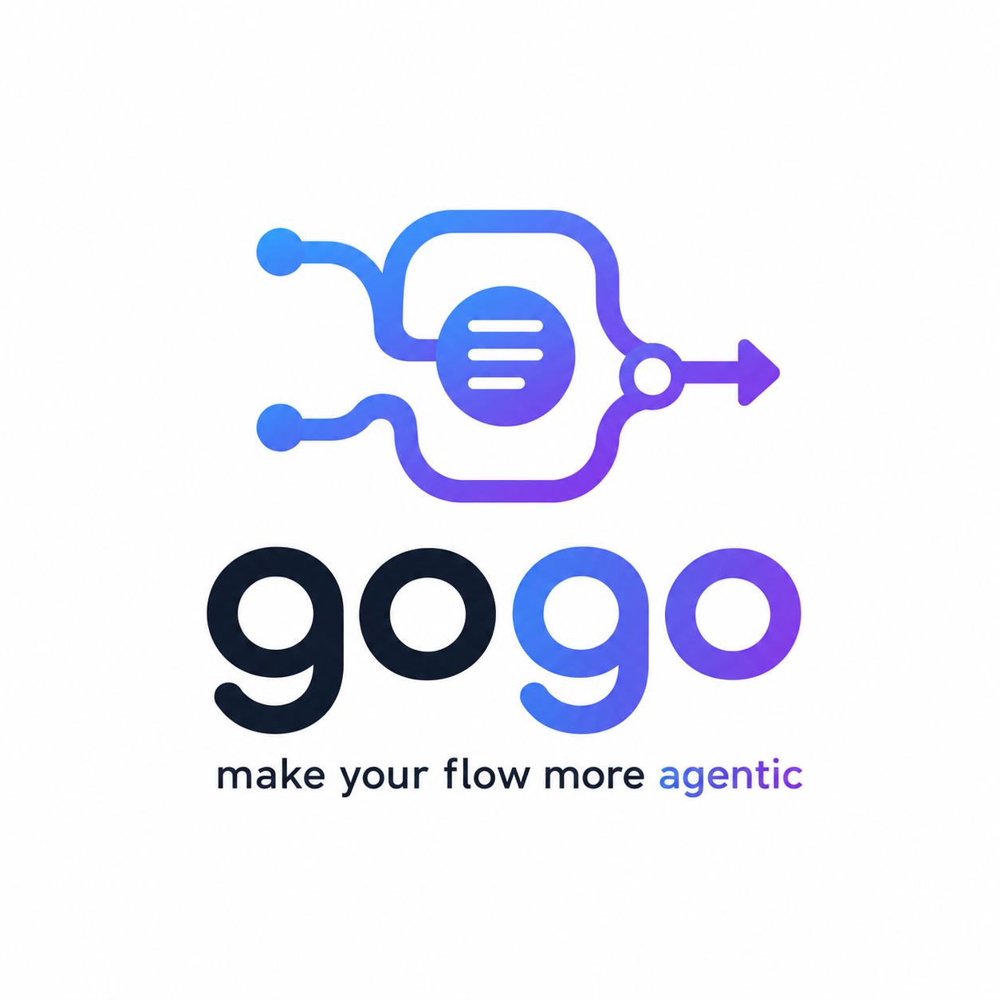

<p align="center">
  
</p>

<h1 align="center">gogo</h1>

<p align="center"><em>make your flow more agentic</em></p>

**A portable, knowledge-grounded development pipeline for Claude Code.**

📖 **Documentation: <https://zawadzkib.github.io/gogo/>** — commands, the flow,
the per-agent I/O reference, discovery, and the contracts, with rendered diagrams.
The site is **generated from** this repo's `commands/`, `agents/`, `skills/`, and
`templates/`; the **code and skills are authoritative** and the site may lag them.

> **The flow is generic and ships with the plugin. The rules are yours.**
> gogo runs every non-trivial change through five fixed phases — **plan →
> implement → review → test → report** — but *what* it plans against, *how* it
> writes code, *what* review flags, and *how* it tests are all driven by plain
> markdown **knowledge files** that gogo wires up from your existing project docs.
> Same pipeline everywhere; the behaviour is configuration.

## The flow


<details>
<summary>Same flow as an editable Mermaid diagram</summary>


</details>

*Plan waits for your acceptance before any code is written. Review and test loop
fixes back into implement, and either can **pause for your decision** at any point
— you answer and it resumes. On success, Report writes an as-built `report/` bundle
(`report/report.md` + diagrams) and updates your knowledge docs, then stops at the
**UAT gate** (`awaiting-uat`) for you to verify the work — running `/gogo:done`
**is** the acceptance, or your feedback loops back into planning on the same work
item (recorded in `uat.md`). **Every phase is grounded in your `.gogo/knowledge/`
config.***

## Generic flow, your rules

The five phases never change. What changes per project lives in **`.gogo/knowledge/`**
— small markdown files, one concern each, that gogo reads at the relevant phase.
**These files are the configuration**: they're what make the generic flow behave
like *your* project.

| File | What it holds | Read in |
|---|---|---|
| `analysis.md` | how to analyze a feature before planning: the procedure, which files to read, code = source of truth | Plan |
| `project-knowledge.md` | architecture, domains, glossary, key decisions | Plan |
| `tech-stack.md` | languages, frameworks, and the build / run / test commands | Plan · Implement · Test |
| `non-functional-requirements.md` | standing quality bars: performance, security, accessibility, reliability, limits | Plan · Review · Test |
| `coding-rules.md` | conventions the implementation must follow | Implement · Review |
| `code-review-standards.md` | what review checks for: correctness, security, performance, error handling, style | Review |
| `testing-tools.md` | the test tools and exactly how to run them | Test |
| `test-strategy.md` | how to test: user journeys, UI / design checks, e2e levels, deploy checks, the done-bar | Test |
| `index.md` | a purpose-map of the folder + the proxy convention | — |
| `_discovered.md` | what `/gogo:build` found and how each file was wired (regenerated each run) | build |

On success, the **Report** phase writes anything it learned back into these files
(your gogo-owned summaries), keeping them current.

These files are **proxies**: they link to your project's real docs (an existing
`CLAUDE.md`, `README`, `CONTRIBUTING`, Copilot / Cursor / Windsurf / Codex configs,
manifests, test configs) and add a short gogo-specific summary — they don't
duplicate them. Where a project has no doc for a topic, gogo authors that file
from your codebase. You create them once with `/gogo:build` and refresh anytime;
re-runs pick up new docs and **preserve your edits**.

**Your own notes survive: `## Custom`.** Any knowledge file can carry a `## Custom`
section — anything *you* write there is **user-owned and copied 1:1**: `/gogo:build`
re-runs and the report phase **never rewrite it** (build reports what it preserved).
It sits alongside the gogo-authored `## gogo overrides` block — the distinction is
simply **overrides = gogo's notes; Custom = yours, untouchable.**

So adopting gogo in a new project is just `/gogo:build` — no flow to rewrite.

## How it works

Want the full picture — the flow-vs-knowledge split, *why* knowledge is split
again into always-read config vs on-demand skills, and exactly what gets stored
where (plugin side vs your project's `.gogo/`)? See
[**docs/architecture.md**](docs/architecture.md).

In short: the **flow ships with the plugin** (`commands/`, `skills/`, `agents/`),
the **rules live in your project** (`.gogo/knowledge/`), and situational detail
that would bloat the always-read config is extracted into **on-demand skills**
(`.gogo/skills/`, or `.claude/skills/` for reusable ones) that load only when a
task needs them — keeping each phase's context small and the LLM workers
deterministic.

## Quickstart

```
/plugin marketplace add ZawadzkiB/gogo
/plugin install gogo@gogo

/gogo:build                 # wire gogo to this project's docs (run once; re-run anytime)
/gogo:plan "add CSV export to the reports page"
# review the plan, accept it, then:
/gogo:go                    # implement → review → test → report, stops at the UAT gate
# verify the work, then:
/gogo:done                  # your acceptance — ships it to the changelog (or give feedback to loop back)
```

> Hacking on gogo itself? Add your local clone as the marketplace instead of the
> GitHub one (they share the name `gogo`, so use one or the other):
> `/plugin marketplace add /path/to/gogo`.

## Updating

`/plugin install` reads a **local copy** of the marketplace, so installing on its
own never pulls a newer version. Refresh the marketplace first, then reinstall:

```
/plugin marketplace update gogo   # fetch the latest gogo from GitHub
/plugin install gogo@gogo         # install the bumped version
/reload-plugins                   # apply it to the running session
```

To confirm which version is active, run `/plugin` and check gogo's version, or
inspect the install cache:

```
ls ~/.claude/plugins/cache/gogo/gogo/   # newest dir = active version
```

> Using a local clone as the marketplace? A plain `git pull` in the clone is
> enough — no `marketplace update` needed — followed by `/reload-plugins`.

## Developing gogo locally

Point the marketplace at your clone once:

```
/plugin marketplace add /path/to/gogo
/plugin install gogo@gogo
```

Then, after each change:

1. Edit files in the clone.
2. Bump `version` in `.claude-plugin/plugin.json` (the reload only picks up a new version).
3. Reload and restart Claude Code:
   ```
   claude plugin marketplace update gogo
   claude plugin update gogo@gogo
   ```

## Commands

Each command is an ultra-thin entry point to the orchestrator — no flow logic
lives in the commands themselves.

**`/gogo:build [--force]`**

Set up or refresh the project's knowledge config. Discovers your existing docs
(`CLAUDE.md`, Copilot / Cursor / Windsurf / Codex configs, README, manifests,
test/CI configs) **at any depth** — including nested monorepo packages like
`frontend/.github/` — plus a sweep of all project markdown and a light pass over
in-code doc comments, then wires each knowledge file as a proxy, or synthesizes it
from the codebase when none exists. It then **verifies the high-signal facts
against your actual code** (tech stack, build/run/test commands, test framework,
entry points) — on a conflict **code wins**, so a stale doc can't quietly poison
the config (gogo corrects its own summary, never your upstream file). Idempotent:
re-run anytime to pick up new docs while preserving your edits. `--force` resets to
fresh scaffolds.

**`/gogo:skills ["<prompt>"] [--warn N] [--max N] [--include <path>]`**

Keep your knowledge config lean so the pipeline stays deterministic. Audits every
`.gogo/knowledge/*.md` against a line budget (OK `<200` · WARN `200-400` · OVER
`>400`), auto-discovers cohesive sections worth pulling out, classifies each as a
`knowledge` skill (→ `.gogo/skills/`) or a `standalone` skill (→ `.claude/skills/`),
and **proposes them, then stops for your per-candidate approval** before writing
anything. On approval it extracts each into a `SKILL.md` (+ optional `scripts/` /
`.env.example`) and leaves a `**Load when:**` pointer in the parent. Directed mode
— `/gogo:skills "extract the deploy runbook"` — pulls out exactly what you name.
Idempotent; re-run anytime. Knowledge-maintenance sibling of `/gogo:build`.

**`/gogo:plan "<goal>"`**

Runs the plan phase only. Writes an accept-pending plan to
`.gogo/work/feature-<slug>/` (with the feature's functional requirements, a changes
checklist, and a mermaid chart) and **stops for your acceptance** — no code is
written until you accept.

**`/gogo:go [feature-slug]`**

Implements the accepted plan through the implement → review → test → report loop,
delegating to the specialist agents and pausing only at real decisions. Refuses to
start until a plan is accepted.

The implement → review → test → report phases are **also runnable on their own**
— each is a thin, idempotent entry point to its phase skill that **validates its
inputs** before working and **validates its outputs** before hand-off (the
contract layer, below). `/gogo:go` chains these same commands.

**`/gogo:implement [feature-slug] [--issues <path>]`**

Phase ② standalone. Plain, it builds the accepted plan from scratch and emits the
as-built diagram set. With `--issues <path>` (a `review/issues.json` or
`test/issues.json`) it fixes the **open** issues and writes back what was fixed
(`status: fixed`, `fix_summary`, `fixed_in_round`).

**`/gogo:review [feature-slug]`**

Phase ③ standalone. Fresh-eyes review against your standards; emits the living,
typed `review/issues.json` (the contract) and renders a `review-NN.md` snapshot.
Re-run it after fixes — it updates the same list in place (open → fixed/verified,
adds new).

**`/gogo:test [feature-slug]`**

Phase ④ standalone. e2e/UI/CLI/API testing per your strategy; emits the living
`test/issues.json` + a `test-NN.md` snapshot, looping issues back to implement.

**`/gogo:report [feature-slug]`**

Phase ⑤ standalone. For an all-green feature: finalizes the plan to as-built,
writes the `report/` bundle (`report/report.md` + the as-built UML diagrams), and
updates your gogo-owned knowledge docs. Run standalone, it **also (re)generates a
report for a past or broken run** — synthesizing a best-effort `report/report.md`
from whatever artifacts exist (plan, decisions, review/test issues, state, charts)
and clearly marking which phases ran and what's still open. `plan.md` is the one
prerequisite. (The in-pipeline ⑤, right after a green test, keeps its strict gate.)

**`/gogo:done [feature-slug | slug1+slug2+...]`**

Ship report-complete features into a high-level changelog. A **slug** ships that one;
**`slug1+slug2+...`** ships those as ONE merged release entry; **no slug opens the work
board cockpit** over every `.gogo/work/feature-*` — the shared `/gogo:status` classifier
labels each **shipped · ready-to-ship · in-progress · unfinished** and from the
four-class table you **view** any card (`v`), **ship** ready cards separately (`s`) or
**merged** (`m`), **run/resume** the pipeline on an unbuilt card (`g`), and **filter**
(`/`) — an interactive terminal kanban when `python3` + `tmux` + a tty are present,
otherwise a status table + multi-select ship fallback (never failing over the board).
Each key writes a single-shot **intent** the orchestrator runs before **relaunching**
the board (`go` hands off to the pipeline; `q` cancels). When you ship merged (or pick
**≥2** in the fallback), one question gates separate (N entries) vs merged (1
entry). Every entry is a **high-level synthesis, not a copy** of the report bundle —
gogo **writes** a `report.md` summarizing *what was changed/done/implemented* (key
outcomes, one-line decisions, a review/test verdict, a member table + per-member section
when merged) with a **link back** to each member's `.gogo/work/` folder for the full
audit trail — plus the slug-prefixed `.mmd` set, a `manifest.json` carrying a
`members[]` array, and the merged `before/` set, into
`.gogo/changelog/<YYYY-MM-DD>-<name>/` (date = newest member's `completed:`; **no
`diagrams.html` copy** — the viewer builds from source). It **builds the interactive
viewer page for the entry and prints its `file://` link** (best-effort, reusing the
`/gogo:view` build; falls back to the changelog folder path — never failing over the
link), and sets **each member's** `state.md` to a terminal `shipped` status. The audit
trail stays in `.gogo/work/`; idempotent. A named slug with no report stops and tells
you to run `/gogo:report <feature>` first.

**`/gogo:view [changelog-entry | feature-slug[:plan|:report]]`**

Open a gogo **plan or report** as a self-contained, offline **interactive webpage** —
the `plan.md` / `report.md` summary rendered as readable HTML plus its mermaid diagrams
made **interactive** (vendored runtime, no network, no build). Flowchart-family diagrams
get an xplan-style rich renderer: custom-styled node cards you **drag** with edges
that **re-route live**, plus **zoom / fit / minimap** and a **persisted layout**;
other kinds fall back to a pan/zoom/drag canvas. A bundle carrying a `before/` set
renders **before / after side by side** (compare mode). With no arg it presents a
grouped **Work** (each feature's plan + report) / **Changelog** (shipped reports)
picker — plans render in place from `plan.md` + `charts/` — and opens your pick; falls
back to printing the `file://` path if it can't auto-open.

**`/gogo:status`**

Lists every feature under `.gogo/work/` with its phase, status, and iteration counts.
Read-only. It also hosts the shared **work-index classifier** (shipped · ready-to-ship
· in-progress · unfinished) that the `/gogo:done` work board reuses to decide what is
shippable.

**`/gogo:resume [feature-slug]`**

Resumes a feature that paused for your decision, folding your answer into
`decisions.md` and continuing the loop.

## The gogo CLI

An **instant, deterministic cockpit** for your pipeline — a native **`gogo`
binary** (Go + Bubble Tea, in `cli/`) that opens a kanban board in milliseconds
by **parsing the contract files the plugin already writes** ([the CLI
contract](https://zawadzkib.github.io/gogo/cli-contract.html)) with **no LLM in
the read path**. It is a companion binary, **not** a 13th slash command — the
slash commands stay the pipeline engine; the CLI is the read/launch cockpit.

**Install** — grab the prebuilt binary from the GitHub release (no Go needed;
the `uname` bits pick the right asset — darwin/linux × arm64/amd64):

```bash
# into ~/bin (no sudo)
mkdir -p ~/bin && \
curl -fsSL "https://github.com/ZawadzkiB/gogo/releases/latest/download/gogo-$(uname -s | tr 'A-Z' 'a-z')-$(uname -m | sed 's/x86_64/amd64/;s/aarch64/arm64/')" -o ~/bin/gogo && \
chmod +x ~/bin/gogo
```

(If `gogo` isn't found afterwards, add `~/bin` to your PATH:
`export PATH="$HOME/bin:$PATH"` in your shell rc.)

```bash
# or system-wide (sudo)
curl -fsSL "https://github.com/ZawadzkiB/gogo/releases/latest/download/gogo-$(uname -s | tr 'A-Z' 'a-z')-$(uname -m | sed 's/x86_64/amd64/;s/aarch64/arm64/')" -o /tmp/gogo && \
sudo mv /tmp/gogo /usr/local/bin/gogo && sudo chmod +x /usr/local/bin/gogo
```

Pin a version by replacing `latest/download` with `download/vX.Y.Z`. Assets:
`gogo-darwin-arm64` · `gogo-darwin-amd64` · `gogo-linux-amd64` ·
`gogo-linux-arm64` (built + attached by `.github/workflows/release.yml` on
every `v*` tag).

**Or build from source** (needs Go 1.25+, matching `cli/go.mod`):

```bash
cd cli && go build -o gogo .
# `go install ./cli` also works, but names the binary after the module tail
# (`cli`, not `gogo`) — rename it, or prefer the explicit `-o gogo` build above.
```

**What it does:**

- **Board** (`gogo`) — four columns **plan · in progress · ready · changelog**
  from the ported work-index classifier; cards are your feature folders with a
  live sub-phase badge (`review r2`, `waiting-for-user`, `awaiting-uat`,
  `running`). `/` filters live; **fsnotify** refreshes the board while the
  pipeline runs.
- **Drill-in** (`enter`) — browse a feature's files **in the terminal**:
  markdown via **glamour**, `issues.json` as a table, `events.jsonl` as a
  timeline, `.mmd` diagrams as ASCII (flowchart-family) or source; `w` builds
  the interactive HTML page natively (goldmark, before/after compare) and opens
  the browser; `G` opens the file in `glow` when installed.
- **Moves launch Claude** — `m` on a plan/in-progress card runs
  `claude "/gogo:go <slug>"`; selecting ready cards (`space`) and pressing `m`/`d`
  runs `claude "/gogo:done a+b+c"` (multiple = ONE merged entry) — always behind a
  confirmation, in an attachable **tmux** session (`a` attaches; gates stay
  answerable). Launches run in claude's **auto (classifier) permission mode** so
  the skills' safe file steps don't nag inside an unwatched session (NOT a full
  bypass); set `GOGO_CLAUDE_PERMISSION_MODE` to override the value (any
  `claude --permission-mode` value; empty string omits the flag → claude prompts),
  and the confirm states the effective mode. The CLI **never mutates pipeline
  state** — a card moves columns only when the contract files actually change.
- **Peek a session (`l`)** — read-only view of a live `gogo-*` session's recent
  output (`tmux capture-pane`, `r` re-captures) without attaching; for a
  backgrounded `claude -p` run it tails the log instead. `a` from the peek
  escalates to a full attach.
- **Delete to trash (`x`)** — moves a card's work folder to `.gogo/trash/` behind
  an explicit confirm (recoverable, never `rm`); changelog cards are append-only
  and bounce. `gogo trash` lists deleted work; `gogo trash restore <entry>` puts
  it back.
- **Scriptable** — `gogo status` (classifier table), `gogo view <slug>[:plan|:report] [--web] [--open]`,
  `gogo events <slug>`, `gogo trash [restore <entry>]`, `gogo --version` (mirrors the plugin).

**Soft deps** (detected at use, graceful fallback): `tmux` (else backgrounded
`claude -p` + log), `claude` (needed only to launch), `glow` (the built-in
glamour view is the fallback). Keymap: `←→`/`h` columns · `↑↓`/`jk` cards ·
`space` select · `enter` drill-in · `v` view · `w` web · `m` move · `d` ship ·
`a` attach · `l` peek · `x` delete→trash · `/` filter · `G` glow · `q` quit.

## Agents

- **`gogo`** — the orchestrator: owns the flow/loop, knows what to run when, and
  delegates to the specialists. Also usable hands-off ("build X end-to-end").
- **`gogo-analyst`** — phase ① specialist: reads `analysis.md` + the named knowledge
  set, analyses the goal against the actual code, and writes the plan (and re-analyses
  UAT feedback into a plan delta on the same work item).
- **`gogo-developer`** — implements the accepted plan and applies review/test fixes.
- **`gogo-reviewer`** — fresh-eyes, adversarial code review.
- **`gogo-tester`** — e2e/UI testing via the bundled Playwright MCP.

## What gets created in your project

gogo keeps everything under one **`.gogo/`** folder — plain markdown you can read,
edit, and commit:

**`.gogo/knowledge/`** — your project's configuration: the ten files described in
[**Generic flow, your rules**](#generic-flow-your-rules) above. Every file states
its own purpose in its header, and `index.md` is the folder's purpose-map.

**`.gogo/skills/`** — on-demand skills `/gogo:skills` has extracted from your
knowledge files: cohesive, situational detail moved out of the always-read config
into skills that load **only when relevant**, keeping the pipeline lean and
deterministic. `.gogo/skills/index.md` is the registry. A candidate the command
classifies as **standalone** (a reusable, self-contained capability) instead lands
in **`.claude/skills/<slug>/`** so Claude Code auto-discovers it — written only
when you approve that candidate (the one sanctioned write outside `.gogo/`).

**`.gogo/resources/`** — one vendored mermaid runtime per project
(`mermaid.min.js`, shared by every feature) plus the interactive viewer module set
(`viewer/`) that `/gogo:view` and `/gogo:done` build pages from (into `view/`), and
`kanban/` (the `/gogo:done` work-board scratch — the vendored `board.py`, the
work-index, and the board-intent). Offline, no network, no build.

**`.gogo/work/feature-<slug>/`** — one folder per piece of work:

| File | Purpose |
|---|---|
| `plan.md` | The accepted plan (the contract), incl. the feature's functional requirements |
| `adjustments.md` | Log of changes/clarifications you asked for during planning |
| `state.md` | Current phase/status/iterations — lets work resume across sessions |
| `decisions.md` | Forks that needed your call, with gogo's recommendation + your answer |
| `uat.md` | The **UAT gate** log (appears once report ⑤ reaches `awaiting-uat`) — one round per user check: a `/gogo:done` accept line, or an analyst-authored issues round (verbatim input + analysis + plan delta + verdict) when feedback loops back into planning on the same work item |
| `review/issues.json` | The living, typed review findings — the **contract** review hands to implement (one list, updated in place across rounds) |
| `review-NN.md` | Each code-review round's rendered snapshot of `issues.json` |
| `test/issues.json` | The living, typed test findings (same contract) |
| `test-NN.md` | Each test round's rendered snapshot |
| `events.jsonl` | Append-only progress telemetry — one JSON line per phase transition (schema'd), read by the `gogo` CLI cockpit; a missing file is never an error |
| `report/` | The as-built bundle (written at report phase): `report/report.md` (planned-vs-shipped, implementation, decisions + reasons, review/test outcomes), the UML set (`.mmd` chosen by the diff), `report/before/` (the plan-time "before" set copied in for a self-contained before/after compare), `diagrams.html`, `manifest.json`. This is the full audit trail; `/gogo:done` **synthesizes** a high-level entry from it into `.gogo/changelog/<date>-<name>/` (it does not copy the bundle) |
| `charts/` | Mermaid diagrams (`.mmd`) + `charts/before/` (the plan-time as-is baseline) + `manifest.json` + an offline `diagrams.html` viewer — the plan's intended design, plus the implement as-built flow / sequence / class / activity set |

**`.gogo/trash/`** — deleted work, recoverable. Deleting a board card (`x` in the
`gogo` CLI) **moves** its `feature-<slug>/` folder here (`<compact-ts>-<slug>/`,
never `rm`); `gogo trash` lists it and `gogo trash restore <entry>` puts it back.
The CLI's one write outside `.gogo/resources/`.

**`.gogo/changelog/`** — the append-only shipped archive, a high-level release
history. When you run `/gogo:done`, gogo **synthesizes** an entry into
`.gogo/changelog/<YYYY-MM-DD>-<name>/` — a written `report.md` (not a copy of the
report bundle) + the slug-prefixed `.mmd` set + a `manifest.json` with a `members[]`
array + the `before/` set. One or several related features can ship as a single merged
release entry; the full detail stays in `.gogo/work/`. `/gogo:view` reads from here too.

The typed artifacts (`*/issues.json`, `charts/manifest.json`, per-run
`result.json`, the feature `pipeline.json`) follow JSON Schemas shipped in the
plugin (`templates/contracts/`). Each phase command validates its inputs and
outputs against them so a bad LLM hand-off is caught, not propagated — the
validation is portable (`jq`/schema if present, else the agent checks against the
schema; no new required dependency).

## Portability & prerequisites

gogo is built to run anywhere it's installed:

- The core **plan → implement → review → test** loop needs **no external
  dependencies**.
- **Mermaid** diagrams render natively in GitHub / VS Code / JetBrains from
  fenced ` ```mermaid ` blocks; the bundled offline viewer needs only a browser
  (mermaid is vendored — no network, no CLI).
- **Browser / UI testing** uses the bundled **Playwright MCP**, which boots via
  `npx` on first use (needs **Node.js**). Without it, the test phase falls back to
  API/CLI tests plus written manual steps.

Optional: set `GOGO_NTFY_TOPIC` in your shell to get a phone push (via
[ntfy.sh](https://ntfy.sh)) when gogo pauses for your input. Without it you still
get a local desktop notification + a terminal bell.

## License

MIT — see [LICENSE](./LICENSE).
