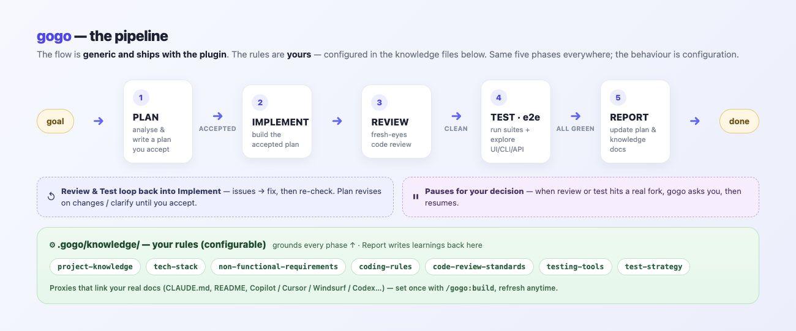

# gogo

**A portable, knowledge-grounded development pipeline for Claude Code.**

> **The flow is generic and ships with the plugin. The rules are yours.**
> gogo runs every non-trivial change through five fixed phases — **plan →
> implement → review → test → report** — but *what* it plans against, *how* it
> writes code, *what* review flags, and *how* it tests are all driven by plain
> markdown **knowledge files** that gogo wires up from your existing project docs.
> Same pipeline everywhere; the behaviour is configuration.

## The flow



<details>
<summary>Same flow as an editable Mermaid diagram</summary>


</details>

*Plan waits for your acceptance before any code is written. Review and test loop
fixes back into implement, and either can **pause for your decision** at any point
— you answer and it resumes. On success, Report writes an as-built `report.md` +
diagrams and updates your knowledge docs.
**Every phase is grounded in your `.gogo/knowledge/` config.***

## Generic flow, your rules

The five phases never change. What changes per project lives in **`.gogo/knowledge/`**
— small markdown files, one concern each, that gogo reads at the relevant phase.
**These files are the configuration**: they're what make the generic flow behave
like *your* project.

| File | What it holds | Read in |
|---|---|---|
| `project-knowledge.md` | architecture, domains, glossary, key decisions | Plan |
| `tech-stack.md` | languages, frameworks, and the build / run / test commands | Plan · Implement · Test |
| `non-functional-requirements.md` | standing quality bars: performance, security, accessibility, reliability, limits | Plan · Review · Test |
| `coding-rules.md` | conventions the implementation must follow | Implement · Review |
| `code-review-standards.md` | what review checks for: correctness, security, performance, error handling, style | Review |
| `testing-tools.md` | the test tools and exactly how to run them | Test |
| `test-strategy.md` | how to test: user journeys, UI / design checks, e2e levels, deploy checks, the done-bar | Test |
| `index.md` | a purpose-map of the folder + the proxy convention | — |
| `_discovered.md` | what `/gogo:build` found and how each file was wired (regenerated each run) | build |

On success, the **Report** phase writes anything it learned back into these files
(your gogo-owned summaries), keeping them current.

These files are **proxies**: they link to your project's real docs (an existing
`CLAUDE.md`, `README`, `CONTRIBUTING`, Copilot / Cursor / Windsurf / Codex configs,
manifests, test configs) and add a short gogo-specific summary — they don't
duplicate them. Where a project has no doc for a topic, gogo authors that file
from your codebase. You create them once with `/gogo:build` and refresh anytime;
re-runs pick up new docs and **preserve your edits**.

So adopting gogo in a new project is just `/gogo:build` — no flow to rewrite.

## How it works

Want the full picture — the flow-vs-knowledge split, *why* knowledge is split
again into always-read config vs on-demand skills, and exactly what gets stored
where (plugin side vs your project's `.gogo/`)? See
[**docs/architecture.md**](docs/architecture.md).

In short: the **flow ships with the plugin** (`commands/`, `skills/`, `agents/`),
the **rules live in your project** (`.gogo/knowledge/`), and situational detail
that would bloat the always-read config is extracted into **on-demand skills**
(`.gogo/skills/`, or `.claude/skills/` for reusable ones) that load only when a
task needs them — keeping each phase's context small and the LLM workers
deterministic.

## Quickstart

```
/plugin marketplace add ZawadzkiB/gogo
/plugin install gogo@gogo

/gogo:build                 # wire gogo to this project's docs (run once; re-run anytime)
/gogo:plan "add CSV export to the reports page"
# review the plan, accept it, then:
/gogo:go
```

> Hacking on gogo itself? Add your local clone as the marketplace instead of the
> GitHub one (they share the name `gogo`, so use one or the other):
> `/plugin marketplace add /path/to/gogo`.

## Updating

`/plugin install` reads a **local copy** of the marketplace, so installing on its
own never pulls a newer version. Refresh the marketplace first, then reinstall:

```
/plugin marketplace update gogo   # fetch the latest gogo from GitHub
/plugin install gogo@gogo         # install the bumped version
/reload-plugins                   # apply it to the running session
```

To confirm which version is active, run `/plugin` and check gogo's version, or
inspect the install cache:

```
ls ~/.claude/plugins/cache/gogo/gogo/   # newest dir = active version
```

> Using a local clone as the marketplace? A plain `git pull` in the clone is
> enough — no `marketplace update` needed — followed by `/reload-plugins`.

## Commands

Each command is an ultra-thin entry point to the orchestrator — no flow logic
lives in the commands themselves.

**`/gogo:build [--force]`**

Set up or refresh the project's knowledge config. Discovers your existing docs
(`CLAUDE.md`, Copilot / Cursor / Windsurf / Codex configs, README, manifests,
test/CI configs) **at any depth** — including nested monorepo packages like
`frontend/.github/` — plus a sweep of all project markdown and a light pass over
in-code doc comments, then wires each knowledge file as a proxy, or synthesizes it
from the codebase when none exists. Idempotent: re-run anytime to pick up new docs
while preserving your edits. `--force` resets to fresh scaffolds.

**`/gogo:skills ["<prompt>"] [--warn N] [--max N] [--include <path>]`**

Keep your knowledge config lean so the pipeline stays deterministic. Audits every
`.gogo/knowledge/*.md` against a line budget (OK `<200` · WARN `200-400` · OVER
`>400`), auto-discovers cohesive sections worth pulling out, classifies each as a
`knowledge` skill (→ `.gogo/skills/`) or a `standalone` skill (→ `.claude/skills/`),
and **proposes them, then stops for your per-candidate approval** before writing
anything. On approval it extracts each into a `SKILL.md` (+ optional `scripts/` /
`.env.example`) and leaves a `**Load when:**` pointer in the parent. Directed mode
— `/gogo:skills "extract the deploy runbook"` — pulls out exactly what you name.
Idempotent; re-run anytime. Knowledge-maintenance sibling of `/gogo:build`.

**`/gogo:plan "<goal>"`**

Runs the plan phase only. Writes an accept-pending plan to
`.gogo/plans/feature-<slug>/` (with the feature's functional requirements, a changes
checklist, and a mermaid chart) and **stops for your acceptance** — no code is
written until you accept.

**`/gogo:go [feature-slug]`**

Implements the accepted plan through the implement → review → test → report loop,
delegating to the specialist agents and pausing only at real decisions. Refuses to
start until a plan is accepted.

The implement → review → test → report phases are **also runnable on their own**
— each is a thin, idempotent entry point to its phase skill that **validates its
inputs** before working and **validates its outputs** before hand-off (the
contract layer, below). `/gogo:go` chains these same commands.

**`/gogo:implement [feature-slug] [--issues <path>]`**

Phase ② standalone. Plain, it builds the accepted plan from scratch and emits the
as-built diagram set. With `--issues <path>` (a `review/issues.json` or
`test/issues.json`) it fixes the **open** issues and writes back what was fixed
(`status: fixed`, `fix_summary`, `fixed_in_round`).

**`/gogo:review [feature-slug]`**

Phase ③ standalone. Fresh-eyes review against your standards; emits the living,
typed `review/issues.json` (the contract) and renders a `review-NN.md` snapshot.
Re-run it after fixes — it updates the same list in place (open → fixed/verified,
adds new).

**`/gogo:test [feature-slug]`**

Phase ④ standalone. e2e/UI/CLI/API testing per your strategy; emits the living
`test/issues.json` + a `test-NN.md` snapshot, looping issues back to implement.

**`/gogo:report [feature-slug]`**

Phase ⑤ standalone. For an all-green feature: finalizes the plan to as-built,
writes `report.md` + the as-built diagrams, and updates your gogo-owned knowledge
docs.

**`/gogo:status`**

Lists every feature under `.gogo/plans/` with its phase, status, and iteration counts.
Read-only.

**`/gogo:resume [feature-slug]`**

Resumes a feature that paused for your decision, folding your answer into
`decisions.md` and continuing the loop.

## Agents

- **`gogo`** — the orchestrator: owns the flow/loop, knows what to run when, and
  delegates to the specialists. Also usable hands-off ("build X end-to-end").
- **`gogo-developer`** — implements the accepted plan and applies review/test fixes.
- **`gogo-reviewer`** — fresh-eyes, adversarial code review.
- **`gogo-tester`** — e2e/UI testing via the bundled Playwright MCP.

## What gets created in your project

gogo keeps everything under one **`.gogo/`** folder — plain markdown you can read,
edit, and commit:

**`.gogo/knowledge/`** — your project's configuration: the nine files described in
[**Generic flow, your rules**](#generic-flow-your-rules) above. Every file states
its own purpose in its header, and `index.md` is the folder's purpose-map.

**`.gogo/skills/`** — on-demand skills `/gogo:skills` has extracted from your
knowledge files: cohesive, situational detail moved out of the always-read config
into skills that load **only when relevant**, keeping the pipeline lean and
deterministic. `.gogo/skills/index.md` is the registry. A candidate the command
classifies as **standalone** (a reusable, self-contained capability) instead lands
in **`.claude/skills/<slug>/`** so Claude Code auto-discovers it — written only
when you approve that candidate (the one sanctioned write outside `.gogo/`).

**`.gogo/plans/feature-<slug>/`** — one folder per piece of work:

| File | Purpose |
|---|---|
| `plan.md` | The accepted plan (the contract), incl. the feature's functional requirements |
| `adjustments.md` | Log of changes/clarifications you asked for during planning |
| `state.md` | Current phase/status/iterations — lets work resume across sessions |
| `decisions.md` | Forks that needed your call, with gogo's recommendation + your answer |
| `review/issues.json` | The living, typed review findings — the **contract** review hands to implement (one list, updated in place across rounds) |
| `review-NN.md` | Each code-review round's rendered snapshot of `issues.json` |
| `test/issues.json` | The living, typed test findings (same contract) |
| `test-NN.md` | Each test round's rendered snapshot |
| `report.md` | The as-built final report (written at report phase): planned-vs-shipped, changes, review/test outcomes, diagram links |
| `charts/` | Mermaid diagrams (`.mmd`) + `manifest.json` + an offline `diagrams.html` viewer — the plan's intended design, plus the implement/report as-built flow / sequence / class / activity set |

The typed artifacts (`*/issues.json`, `charts/manifest.json`, per-run
`result.json`, the feature `pipeline.json`) follow JSON Schemas shipped in the
plugin (`templates/contracts/`). Each phase command validates its inputs and
outputs against them so a bad LLM hand-off is caught, not propagated — the
validation is portable (`jq`/schema if present, else the agent checks against the
schema; no new required dependency).

## Portability & prerequisites

gogo is built to run anywhere it's installed:

- The core **plan → implement → review → test** loop needs **no external
  dependencies**.
- **Mermaid** diagrams render natively in GitHub / VS Code / JetBrains from
  fenced ` ```mermaid ` blocks; the bundled offline viewer needs only a browser
  (mermaid is vendored — no network, no CLI).
- **Browser / UI testing** uses the bundled **Playwright MCP**, which boots via
  `npx` on first use (needs **Node.js**). Without it, the test phase falls back to
  API/CLI tests plus written manual steps.

Optional: set `GOGO_NTFY_TOPIC` in your shell to get a phone push (via
[ntfy.sh](https://ntfy.sh)) when gogo pauses for your input. Without it you still
get a local desktop notification + a terminal bell.

## License

MIT — see [LICENSE](./LICENSE).
