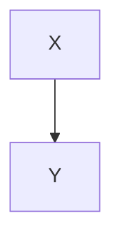

# Plan — sample feature

Status: **accepted** (user, 2026-07-03)

## Goal

Make a **thing** that is `fast` & correct. See [docs](contract.md).

## Table

| Col A | Col B |
|-------|-------|
| one   | two   |

## List

- first item that soft-wraps
  onto a second line
- second item

The mermaid fence above must NOT appear in the summary.
