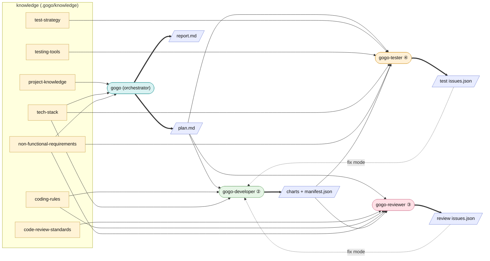

# Agents — the I/O reference

gogo delegates each phase to a fresh-context specialist agent. This is the
reference for **what each agent consumes and produces** — the knowledge files it
reads and the typed artifacts it reads or writes. Source of truth: `agents/*.md`,
the phase skills, and the [contracts](contracts.md).

Knowledge files are proxies into your real docs (see [Discovery](discovery.md));
the typed artifacts (`*/issues.json`, `charts/manifest.json`, `*/result.json`,
`pipeline.json`) follow JSON Schemas and are validated in and out at every
hand-off.

*Solid arrows into an agent = consumes; thick arrows out = produces; the dotted
arrows feed an issues list back to the developer in fix mode.*

## `gogo` — the orchestrator

Owns the flow, the loops, and the decision gates; runs the interactive phases
(① plan, every gate, ⑤ report) and delegates the heads-down phases. It does not
write product code — it coordinates and surfaces genuine decisions.

| Direction | Artifacts |
|---|---|
| Consumes | `.gogo/knowledge/*` (esp. `project-knowledge`, `tech-stack`, `non-functional-requirements`); `state.md`; `decisions.md`; each specialist's `result.json` / issues list |
| Produces | the feature folder; `plan.md`; `adjustments.md`; `state.md` (kept current); `decisions.md` entries; intended-design `charts/`; at ⑤ `report.md`, the as-built `charts/`, and updated gogo-owned knowledge summaries |

## `gogo-developer` — phase ② implement

Implements the accepted plan and applies review/test fixes. Scoped to the plan;
keeps the tree green. Does not make user decisions — it returns forks to the
orchestrator.

| Direction | Artifacts |
|---|---|
| Consumes | `plan.md` (the contract); `coding-rules.md`; `tech-stack.md`; in `--issues` mode `review/issues.json` or `test/issues.json` |
| Produces | code changes; the as-built `charts/` set + `charts/manifest.json`; `implement/result.json`; in fix mode the same issues list written back (`status: fixed`, `fix_summary`, `fixed_in_round`) |

## `gogo-reviewer` — phase ③ review

Skeptical, fresh-eyes review. **Reports only — never edits product code** (it has
no Edit tool by design; it uses Write solely for its snapshot).

| Direction | Artifacts |
|---|---|
| Consumes | the diff (`git diff` vs base, or named files); `plan.md`; `code-review-standards.md`; `coding-rules.md`; `non-functional-requirements.md`; the as-built `charts/manifest.json` |
| Produces | the living `review/issues.json` (each finding tagged severity + agent-fixable / needs-user-decision); a `review-NN.md` snapshot per round with a verdict (`APPROVE` / `CHANGES`) |

## `gogo-tester` — phase ④ test

Runs the suites and exercises the change hands-on (UI via the bundled Playwright
MCP, CLI, API), then extends the e2e tests. Reports findings; may add/adjust test
files but does not fix product code (that is the developer's next loop).

| Direction | Artifacts |
|---|---|
| Consumes | `plan.md` (Tests section); `test-strategy.md`; `testing-tools.md`; `tech-stack.md`; `non-functional-requirements.md`; the as-built `charts/manifest.json` |
| Produces | the living `test/issues.json` (each finding tagged fixable / needs-user-decision); a `test-NN.md` snapshot per round with a verdict against the done-bar; new/extended e2e tests |

Degradation: if the Playwright MCP / Node is unavailable, the tester skips
browser automation, runs the project's own test commands, exercises API/CLI
directly, and writes **manual UI-check steps** into `test-NN.md` — it never fails
the phase for missing browser tooling.
