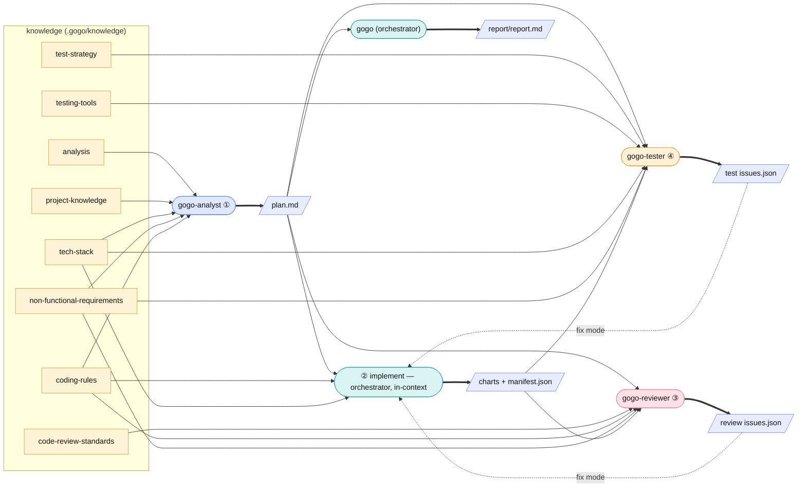

# Agents — the I/O reference

gogo runs ② implement in the orchestrator's own context and delegates the
fresh-eyes phases (①③④) to specialist agents. This is the reference for **what
each agent consumes and produces** — the knowledge files it reads and the typed
artifacts it reads or writes. Source of truth: `agents/*.md`, the phase skills,
and the [contracts](contracts.md).

Knowledge files are proxies into your real docs (see [Discovery](discovery.md));
the typed artifacts (`*/issues.json`, `charts/manifest.json`, `*/result.json`,
`pipeline.json`) follow JSON Schemas and are validated in and out at every
hand-off.

*Solid arrows into an agent = consumes; thick arrows out = produces; the dotted
arrows feed an issues list back to the developer in fix mode.*

**Commands invoke the orchestrator; it runs ② implement in-context and delegates
the fresh-eyes phases to specialist agents (① analyst · ③ reviewer · ④ tester; ⑤
orchestrator + `gogo-knowledge`), owning the gates in chat.**

## `gogo` — the orchestrator

Owns the flow, the loops, and the decision gates; owns the interactive gates (the
plan-acceptance gate, every decision gate, the ⑤ report step, and the **UAT gate** after
⑤). It **runs ② implement in-context** (the one phase it writes product code in — kept
warm across the fix loop) and **delegates the fresh-eyes phases** (① analyst · ③ reviewer
· ④ tester). It surfaces genuine decisions rather than guessing. At the UAT gate it emits
`uat-opened`/`uat-failed` and drives the loop (delegates the analysis to `gogo-analyst`,
gates the re-acceptance, reruns `/gogo:go`); `/gogo:done` owns the acceptance path.

| Direction | Artifacts |
|---|---|
| Consumes | `.gogo/knowledge/*` (esp. `project-knowledge`, `tech-stack`, `non-functional-requirements`); `state.md`; `decisions.md`; `uat.md`; each specialist's `result.json` / issues list |
| Produces | the feature folder (via ①); **② code changes + the as-built `charts/` set + `implement/result.json` (implement is in-context)**; `state.md` (kept current); `decisions.md` entries; the UAT loop's `uat-opened`/`uat-failed` events; at ⑤ the `report/` bundle (`report/report.md` + the as-built UML set + `diagrams.html`), and updated gogo-owned knowledge summaries |

## `gogo-analyst` — phase ① plan

The planning specialist. Reads the named knowledge set (incl. `analysis.md`),
analyses the goal against the actual codebase (**code = source of truth**, following
`analysis.md`'s procedure), and writes the plan the user must accept. Presents the
plan and STOPs — the orchestrator owns the acceptance gate. A leaf agent (no `Task`).
**Second job — the UAT loop:** when a feature at `awaiting-uat` gets user feedback
instead of a `/gogo:done` acceptance, the orchestrator delegates the analysis here — it
weighs the input against the current `plan.md` + `decisions.md` **and the code**, appends
a `uat.md` round (verbatim input + analysis + plan delta + a disposition per point:
`fix-needed` / `works-as-designed` / `new-scope`), updates `plan.md` (logging the delta in
`adjustments.md`), and STOPs for the user to re-accept.

| Direction | Artifacts |
|---|---|
| Consumes | the goal (or UAT feedback); `analysis.md`; `project-knowledge.md`; `tech-stack.md`; `non-functional-requirements.md`; `coding-rules.md`; the actual codebase; at UAT the current `plan.md` + `decisions.md` |
| Produces | the feature folder; `plan.md` (Goal / Context / functional requirements / Approach / Changes checklist / Tests / Out-of-scope); `adjustments.md`; `state.md`; `decisions.md`; the intended-design `charts/` + `charts/before/` set; at UAT a `uat.md` round + the plan delta |

## `gogo-developer` — phase ② implement

The implementer manual made concrete. **On the interactive `/gogo:go` path the
orchestrator runs ② in-context (it stays warm across the fix loop); this agent
backs standalone `/gogo:implement <slug>` and hands-off runs.** Either way it
implements the accepted plan and applies review/test fixes, scoped to the plan,
keeps the tree green, and does not make user decisions — it returns forks to the
orchestrator.

| Direction | Artifacts |
|---|---|
| Consumes | `plan.md` (the contract); `coding-rules.md`; `tech-stack.md`; in `--issues` mode `review/issues.json` or `test/issues.json` |
| Produces | code changes; the as-built `charts/` set + `charts/manifest.json`; `implement/result.json`; in fix mode the same issues list written back (`status: fixed`, `fix_summary`, `fixed_in_round`) |

## `gogo-reviewer` — phase ③ review

Skeptical, fresh-eyes review. **Reports only — never edits product code** (it has
no Edit tool by design; it uses Write solely for its snapshot).

| Direction | Artifacts |
|---|---|
| Consumes | the diff (`git diff` vs base, or named files); `plan.md`; `code-review-standards.md`; `coding-rules.md`; `non-functional-requirements.md`; the as-built `charts/manifest.json` |
| Produces | the living `review/issues.json` (each finding tagged severity + agent-fixable / needs-user-decision); a `review-NN.md` snapshot per round with a verdict (`APPROVE` / `CHANGES`) |

## `gogo-tester` — phase ④ test

Runs the suites and exercises the change hands-on (UI via the bundled Playwright
MCP, CLI, API), then extends the e2e tests. Reports findings; may add/adjust test
files but does not fix product code (that is the developer's next loop).

| Direction | Artifacts |
|---|---|
| Consumes | `plan.md` (Tests section); `test-strategy.md`; `testing-tools.md`; `tech-stack.md`; `non-functional-requirements.md`; the as-built `charts/manifest.json` |
| Produces | the living `test/issues.json` (each finding tagged fixable / needs-user-decision); a `test-NN.md` snapshot per round with a verdict against the done-bar; new/extended e2e tests |

Degradation: if the Playwright MCP / Node is unavailable, the tester skips
browser automation, runs the project's own test commands, exercises API/CLI
directly, and writes **manual UI-check steps** into `test-NN.md` — it never fails
the phase for missing browser tooling.
