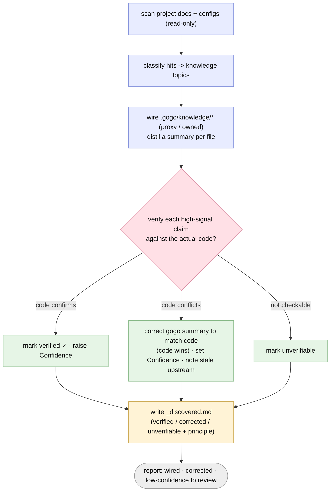

# Discovery — wiring knowledge, then verifying it against code

`/gogo:build` is how a project becomes gogo-enabled: it discovers your existing
docs, wires the `.gogo/knowledge/*` config from them, and then **verifies the
high-signal facts against your actual code**. It is **pure** — Glob / Grep / Read
/ Write only, no compiled tool — so it works in any ecosystem, and **idempotent** —
re-runs reconcile without churn and only ever write under `.gogo/`. Source of
truth: `skills/gogo-build/SKILL.md`.

## How it discovers

A read-only scan globs from the repo root **recursively** (skipping
`node_modules`, `.git`, `.gogo`, build/output/vendor dirs), recording every hit by
its full relative path — so a nested monorepo config like
`frontend/.github/copilot-instructions.md` is kept distinct from a root one. Three
passes:

1. **Assistant configs & known files at every depth** — Claude (`CLAUDE.md`,
   `.claude/`, `AGENTS.md`), Copilot, Cursor, Windsurf, Codex; editor/repo config;
   README / CONTRIBUTING / ARCHITECTURE / `docs/`; manifests + lockfiles; test /
   lint / CI configs.
2. **Full markdown sweep** — `**/*.{md,mdx}` to catch ADRs, runbooks, design notes,
   per-module READMEs (skipping pure noise like `CHANGELOG`, `LICENSE`, templates).
3. **In-code documentation (light, high-signal only)** — module/package doc
   comments that describe how the code is meant to be built/structured (JSDoc on
   entry points, Python module docstrings, Go package docs, etc.).

## Proxy vs owned

Each hit is classified by **content signal** to one or more knowledge topics
(rules-ish -> `coding-rules` / `code-review-standards`; stack-ish -> `tech-stack` /
`testing-tools`; product-ish -> `project-knowledge` / `non-functional-requirements`;
test-ish -> `testing-tools` / `test-strategy`). Then each knowledge file is wired:

| Mode | When | What gogo writes |
|---|---|---|
| **proxy** | at least one source classified to it | `Mode: proxy`, `Source: [the relative paths]`, `Confidence` by source quality, and a short **distilled** summary (never a copy of the whole doc); keeps the `## gogo overrides` section |
| **owned** | no source for the topic | `Mode: owned`, `Source: []`; synthesized from codebase analysis; `Confidence: medium|low` |

On a **re-run** it only refreshes proxy summaries and `Source:` / `Confidence`;
it **never touches** any `## gogo overrides` section or any owned body, and appends
newly-found sources.

## Verifying against code (code is the source of truth)

Docs go stale; code does not lie. After wiring, gogo **cross-checks each
high-signal distilled claim against the actual code** — the tech stack,
build/run/test commands, the test framework, entry points, and key
`package.json` / manifest scripts — against manifests + lockfiles, test/CI
configs, and entry files. For each claim:

| Outcome | Meaning |
|---|---|
| **verified** | the code confirms the claim — raise `Confidence` |
| **corrected** | the code conflicts: *code wins* — gogo corrects its own summary to match the code, sets `Confidence`, and records *doc said X -> code shows Y* |
| **unverifiable** | not mechanically checkable with Glob/Grep/Read — left as-is, flagged |

Two invariants make this safe:

- **Code is the source of truth; docs may be outdated.** When a doc-derived
  summary and the code disagree, gogo trusts the code.
- **Never edit the upstream doc.** Only the **gogo-owned** summary is corrected.
  The proxy's `Source:` link stays; gogo surfaces an *"upstream looks stale"*
  suggestion rather than touching the project's own file.

The results land in `_discovered.md` — a per-claim verified / corrected /
unverifiable table plus the explicit principle — and the corrections are surfaced
in the build report so a human can glance at anything low-confidence. New projects
inherit the section from the `_discovered.md` template.

## Knowledge & on-demand skills

The wired `.gogo/knowledge/*` files are **always-read context** for their phase,
so they are held to a **line budget** — OK `<200` · WARN `200-400` · OVER `>400`
(measuring only the gogo-owned body of a proxy). Oversized always-read context
makes the LLM workers wander, so `/gogo:build` prints a nudge once a file passes
the warn line, and [`/gogo:skills`](commands.md#knowledge-maintenance) extracts
cohesive, situational sections into **on-demand skills** that load only when a
task needs them. The deeper rationale and the two skill kinds (`knowledge` ->
`.gogo/skills/`, `standalone` -> `.claude/skills/`) are in
[Architecture](architecture.md#2-the-knowledge-vs-on-demand-skills-split).

## Guardrails

- Only ever writes inside `.gogo/` — never edits a discovered upstream file.
- Doesn't auto-edit `.gitignore`; prints guidance instead.
- Regenerates `_discovered.md` every run as the audit log of what was found,
  wired, verified, and what wants a human glance.
