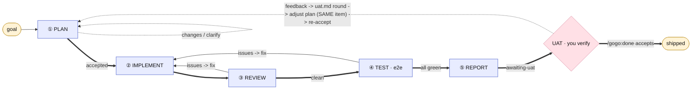

# The flow

Every non-trivial change runs through five fixed phases. The flow is generic and
ships with the plugin; the authoritative description lives in
`skills/gogo/SKILL.md` (the orchestrator's operating manual). Trivial work — a
typo, an obvious one-line fix, a rename — skips the pipeline.

## The phases

### ① Plan — skill `gogo-plan` (delegate to `gogo-analyst`)

Delegated to the **`gogo-analyst`**: it reads the named knowledge set (incl.
`analysis.md`, the analysis procedure), analyses the goal against the actual
codebase (**code = source of truth**), creates `.gogo/work/feature-<slug>/`, writes
`plan.md` (Goal / Context / Functional requirements / Approach + alternatives /
Changes checklist / Tests / Out-of-scope), draws the intended design with
`gogo-mermaid`, and inits `state.md`. **Present the plan and STOP for acceptance —
the orchestrator owns that gate.** Changes or clarifications are logged to
`adjustments.md`, then the plan is revised and re-presented. **Do not implement
until the user accepts — a hard gate.**

### ② Implement — skill `gogo-implement` (delegate to `gogo-developer`)

Build the accepted `plan.md` following `coding-rules.md`; keep changes scoped;
keep build / typecheck / unit green; emit the as-built diagram set. Re-enter here
to apply review/test fixes (`--issues` mode).

### ③ Review — skill `gogo-review` (delegate to `gogo-reviewer`)

Fresh-eyes, adversarial review of the diff against `code-review-standards.md` +
`non-functional-requirements.md`. Findings go to the living `review/issues.json`
plus a `review-NN.md` rendered snapshot per round.

### ④ Test — skill `gogo-test` (delegate to `gogo-tester`)

e2e at every relevant level per `test-strategy.md` / `testing-tools.md` — UI (the
bundled Playwright MCP), CLI, API — plus exploration (does it work? does it look
right?). Results go to the living `test/issues.json` plus a `test-NN.md` snapshot
per round.

### ⑤ Report — skill `gogo-knowledge` (orchestrator)

Finalize `plan.md` to as-built; draw the as-built UML set (chosen by what changed:
class / sequence / activity / use-case / flow) into the feature's `report/` folder;
write `report/report.md` (planned-vs-shipped, implementation, decisions + reasons,
review/test outcomes, diagram + audit links); update whatever `.gogo/knowledge/*`
drifted (gogo-owned summaries only — never the proxied originals, and never a
`## Custom` section); set `state.md` to **`awaiting-uat`** — the UAT gate (no longer
`done`).

Run **standalone via `/gogo:report <feature>`, this phase also reports on a past or
broken run**: instead of refusing a non-green feature it synthesizes a best-effort
`report/report.md` from whatever artifacts exist and marks which phases ran and
what's still open (a "Run status / gaps" section). `plan.md` is the one
prerequisite. The in-pipeline ⑤ call (right after a green ④) keeps its strict gate.

### UAT — the gate between ⑤ and Ship (the plan-gate symmetry)

⑤ leaves the feature at **`status: awaiting-uat`**, and you verify the shipped work. This
is the plan-acceptance gate mirrored at the *exit* — and there is **no extra confirmation
question**. Two ways forward:

- **Accept by running `/gogo:done`** — the command *is* the acceptance. Its validate-in
  requires `awaiting-uat` (a legacy `done` is accepted too), it records a one-line accept
  round in `uat.md`, emits `uat-passed`, and ships. No question is asked.
- **Raise questions/issues instead** — the orchestrator **locks the gate first**: it sets
  `status: waiting-for-user` (`open-decision: UAT round N`, `resume: plan`) and emits
  `uat-opened` **before** handing your input to the **`gogo-analyst`** (its second job).
  The feature **stays `waiting-for-user` for the whole re-plan** — so it is neither
  ship-able (`/gogo:done` needs `awaiting-uat`) nor rerun-able (`/gogo:go` needs
  `plan-accepted`) until you re-accept. The analyst analyses the input against the current
  `plan.md` + `decisions.md` **and the code** (code = source of truth), appends a **`uat.md`
  round** (verbatim input + analysis + proposed plan delta + a disposition per point:
  `fix-needed` / `works-as-designed` / `new-scope`), and updates `plan.md` (`adjustments.md`
  logs the delta). You **re-accept** the adjusted plan — only that flips it to
  `plan-accepted` (recorded through the normal plan-acceptance flow, whose `plan-accepted`
  event is `gogo-plan`'s; the orchestrator then emits `uat-failed`) — and `/gogo:go` reruns
  **②→⑤** on the **SAME work item** (never a new one), back to `awaiting-uat`. `state.md`
  `iterations:` gains `uat=N`.

### Ship — command `/gogo:done` (skill `gogo-done`)

The explicit post-report gate. A **slug** ships that one feature; **`slug1+slug2+...`**
ships those as ONE merged release entry; with **no slug** `/gogo:done` opens the **work
board cockpit** over every `.gogo/work/feature-*` — the shared `gogo-status` classifier
labels each **shipped · ready-to-ship · in-progress · unfinished** and from the
four-class table you **view** any card (`v`), **ship** ready cards separately (`s`) or
**merged** (`m`), **run/resume** the pipeline on an unbuilt card (`g`), and **filter**
(`/`). The board is an **interactive terminal kanban** (`assets/kanban/board.py` in a
tmux pane; `python3` + `tmux` are soft deps) when the tooling and a tty are present,
otherwise a **status table + `AskUserQuestion` multi-select** ship fallback — it never
fails over the board. Each key writes a single-shot **intent** `{schema:2, action,
items}` the orchestrator executes before **relaunching** the board (`go` hands off to the
pipeline; `q` cancels); the board only *collects intents* and never mutates gogo state.
When shipping merged (or a ≥2 fallback selection) one `AskUserQuestion` gates separate (N
entries) vs merged (1 entry).

Every changelog entry is a **high-level synthesis, not a copy** of the report bundle.
`/gogo:done` **writes** a `report.md` summarizing *what was changed/done/implemented*
(lead paragraph, key outcomes, one-line decisions, a review/test verdict, a member table
+ per-member section when merged) with a **link back** to each member's `.gogo/work/`
folder for the full audit trail — plus the **slug-prefixed** `.mmd` set, a merged
`manifest.json` carrying a **`members[]`** array, and the merged `before/` set, into
`.gogo/changelog/<YYYY-MM-DD>-<name>/` (date = newest member's `completed:`; **no
`diagrams.html` copy** — the viewer builds from source). It **builds the interactive
viewer page for the entry and prints its `file://` link** (best-effort, reusing the
`/gogo:view` build; falls back to the changelog folder path — never failing the command
over the link), and sets **each member's** `state.md` to a terminal `shipped` status.
The audit trail stays in `.gogo/work/`; idempotent — re-running overwrites the same dated
entry. A named slug with no report STOPs and tells you to run `/gogo:report <feature>`
first; board mode opens the cockpit whenever any feature exists (`v`/`g` are useful
with nothing ready-to-ship) and stops only when there are zero features.

### View — command `/gogo:view` (skill `gogo-view`)

Read any **plan or report** as a self-contained, offline **interactive webpage** —
the `plan.md` / `report.md` summary as readable HTML plus its mermaid diagrams made
**interactive**. Flowchart-family diagrams (`flow` + `use-case`) get an xplan-style
rich renderer: custom-styled node cards you **drag** with edges that **re-route
live**, plus **zoom / fit / minimap** and a **persisted layout**; other kinds fall
back to a pan / zoom / drag canvas. A bundle carrying a `before/` set renders
**before / after side by side** (compare mode). With no resolvable arg `/gogo:view`
presents a grouped **Work** (each feature's plan + report) / **Changelog** (shipped
reports) picker — plans render in place from `plan.md` + `charts/` (D1=A) — builds the
page from the vendored `.gogo/resources/` assets (no network, no build), and opens it
(printing the `file://` path if it can't auto-open).

## The loops

- **implement <-> review** — loop until review is clean. Bounded: if the same
  finding resists ~3 rounds, it is escalated as a decision.
- **test -> implement -> review -> test** — a test issue re-enters
  implementation, then re-review, then re-test.
- A test issue that needs a user decision routes back to **① plan** (re-plan how
  to handle it, re-accept).
- **UAT -> plan -> go** — at the `awaiting-uat` gate, user feedback routes back to
  **① plan** (via `gogo-analyst`, recorded in `uat.md`), you re-accept, and `/gogo:go`
  reruns ②→⑤ on the **same work item**.
- Round counts are tracked in `state.md` `iterations:` (incl. `uat=N` for UAT loops).

## Who runs each phase

**Commands invoke the orchestrator; the orchestrator delegates every phase to its
specialist agent and owns the gates in chat.**

- **The orchestrator** owns the *interactive gates* in chat: the ① plan-acceptance
  gate, every decision gate, and the ⑤ report step.
- It **delegates every phase** via the `Task` tool, each to a fresh-context
  specialist: ① -> `gogo-analyst`, ② -> `gogo-developer`, ③ -> `gogo-reviewer`,
  ④ -> `gogo-tester`. A delegated worker that hits a real fork **returns** it to
  the orchestrator, which handles the gate and re-delegates with the answer. See
  [Agents](agents.md) for the full I/O reference.

If browser/agent tooling is unavailable, the orchestrator may run a phase's skill
itself in-context — the phase skills run either way.

## Decision gates — stopping for the user

Stop **only** for genuine forks: ambiguous requirements, scope changes,
destructive/irreversible actions, or trade-offs with no obvious right answer. For
everything else, decide, note it, and keep moving. When stopping:

1. Append the question + options + **a recommendation** to `decisions.md` (the
   `D<n>` shape).
2. Set `state.md` -> `status: waiting-for-user`, `resume: <phase>`,
   `open-decision: D<n>`.
3. End the turn and ask (`AskUserQuestion` for clear forks; prose otherwise). The
   Notification hook pings the user.
4. On the answer: append a `RESOLVED` block, clear `open-decision`, and resume at
   `state.md`'s `resume` phase.

## Resume

`state.md` is the single source of truth for where a feature is, kept current at
every transition — so a fresh session or a post-decision continuation picks up
exactly where it left off. `/gogo:status` lists every feature's state;
`/gogo:resume` folds in an answer and continues.
