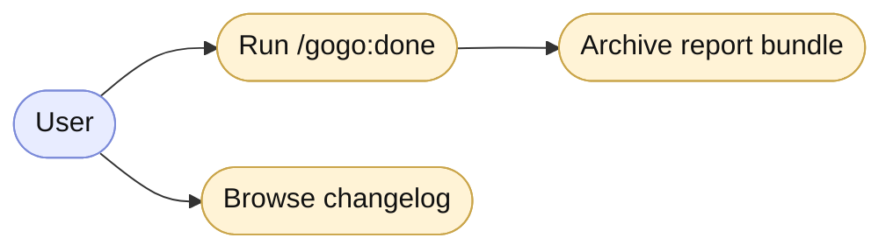

# gogo-mermaid — portable diagrams, no CLI required

This skill produces Mermaid diagrams that render **anywhere**, with **no global
`mmdc`, no Chromium, no network**. Mermaid is vendored inside this plugin
(`${CLAUDE_PLUGIN_ROOT}/assets/mermaid/mermaid.min.js`, a UMD build that works
over `file://`).

## What "a diagram" means in gogo — three artifacts

For each diagram, produce all three so it renders in every context:

1. **A fenced ` ```mermaid ` block** inside the relevant markdown (e.g. `plan.md`).
   This renders natively in GitHub, VS Code, and JetBrains previews — zero deps.
2. **A standalone `.mmd` file** in the feature's `charts/` folder
   (`.gogo/work/feature-<slug>/charts/<name>.mmd`) holding the same source.
3. **The offline viewer** `.gogo/work/feature-<slug>/charts/diagrams.html` — a
   self-contained page that renders every `.mmd` in the folder. Open it in any
   browser; it needs only the vendored `mermaid.min.js`.

## Generating / refreshing `charts/diagrams.html`

1. **Ensure the shared runtime exists** (one copy per project, not per feature):
   if `.gogo/resources/mermaid.min.js` is missing, copy it from
   `${CLAUDE_PLUGIN_ROOT}/assets/mermaid/mermaid.min.js`.
   ```bash
   mkdir -p .gogo/resources
   [ -f .gogo/resources/mermaid.min.js ] || cp "${CLAUDE_PLUGIN_ROOT}/assets/mermaid/mermaid.min.js" .gogo/resources/mermaid.min.js
   ```
2. **Start from the template** `${CLAUDE_PLUGIN_ROOT}/assets/mermaid/viewer.template.html`
   and replace the three tokens:
   - `GOGO_FEATURE_SLUG` → the feature slug.
   - `GOGO_MERMAID_SRC` → the **relative** path from `charts/` to the shared
     runtime. Charts live at `.gogo/work/feature-<slug>/charts/`, three levels
     under `.gogo/`, so this is `../../../resources/mermaid.min.js`.
   - `<!-- GOGO:DIAGRAMS -->` → one block per `.mmd`, in this exact shape (inline
     the source — do **not** `fetch()` it; `file://` forbids it):
     ```html
     <h2>Plan flow</h2>
     <div class="diagram"><pre class="mermaid">
     flowchart TD
       A[user goal] --> B[plan]
     </pre></div>
     ```
3. Write the result to `.gogo/work/feature-<slug>/charts/diagrams.html`.

> Why a shared `.gogo/resources/` copy: it keeps the runtime out of every feature
> folder (one ~3 MB file per project) and high enough that other skills (e.g. the
> viewer) can share it, the path is relative (so the repo stays portable if moved
> or shared), and it works fully offline.

## Optional SVG/PNG export (graceful, never required)

Only if a renderer is already present — never install one:
```bash
if command -v mmdc >/dev/null 2>&1; then
  mmdc -i charts/plan.mmd -o charts/plan.svg -t default -b transparent || true
fi
```
If `mmdc` is absent, **skip silently** — the `.mmd` source + the offline viewer
are the durable artifacts. Note the skip in the report rather than erroring.

## What the diagram is about — read this first

**The subject is always the PRODUCT: the code, its runtime behaviour, its data,
its structure.** A reader should learn *how the feature works*, not *how gogo
built it*.

🚫 **Never draw, as a feature diagram:**
- the **gogo pipeline** (plan→implement→review→test→report) — that lives in the README, not a feature folder;
- the **plan's task checklist / work breakdown** — e.g. `FR1 commit → FR2 docs → FR3 tests → review → merge`. That's a to-do list as a flowchart, not a system diagram. This is the most common mistake — do not make it.
- decision trees about *what to do* (process), as opposed to the system's own control flow.

✅ **Do draw** the feature's actual flow of control/data, the runtime call
sequence between real components, the domain's state machine, or the structure of
the types/modules it adds or changes. Label nodes with **real things** — endpoints,
functions, modules, screens, tables, states — not phase names or FR numbers.

If the change is pure process (docs, test-only, a merge, config) with no
meaningful behaviour or structure to show, **draw nothing** and say so — a missing
diagram beats a misleading work-plan chart.

## Diagram conventions

- **Control / data flow through the system** → `flowchart TD` (or `LR`).
- **Domain lifecycle / status transitions** → `stateDiagram-v2`.
- **Runtime interactions / call sequences between components** → `sequenceDiagram`.
- **Structure / components / types** → `classDiagram`.
- **A new user-facing capability (actors and what they can do)** → a **use-case**
  diagram (see below).
- Keep node labels short; quote labels with punctuation. Prefer one focused
  diagram per concern over one giant chart.

## Use-case diagrams (no native mermaid type)

Mermaid has **no native use-case diagram**, so render one as a `flowchart`
**actor↔use-case graph**: actors are plain nodes, use-cases are rounded/oval
nodes, and edges read "uses". Keep it to the capabilities the change adds.



In the manifest, its `kind` is `use-case` and the file is `use-case.mmd`.

## Choose the kinds by what changed (report phase ⑤)

Draw only the diagrams the **diff** warrants — never a fixed set. Match each
to what the change introduced:

| What changed | Kind |
|---|---|
| New / changed types, modules, relationships | **class** |
| A new runtime interaction (caller → modules → store/API → back) | **sequence** |
| New states, status transitions, or an action flow | **activity** |
| A new user-facing capability (actor can now do X) | **use-case** |
| Control / data flow through the system | **flow** |

Only draw what carries signal — skip any kind that would be trivial. If the
change is pure process, draw nothing and note it.

## When phase ① (plan) vs phase ⑤ (report) draws

- **Plan** draws the *intended design* — the architecture, data flow, or states
  the feature will touch (inferred from the codebase), enough to review the design
  before code exists. Not the build steps.
- **Report** draws the *as-built* set — what actually shipped — choosing the kinds
  by what the diff introduced (see "Choose the kinds by what changed"): a **flow**,
  a **sequence** of the key runtime interaction, an **activity** (lifecycle / state
  / action flow) diagram for new states, a **class** (structure / types) view for
  new/changed types, and a **use-case** view for a new user-facing capability.
  Update the plan's diagrams where they still hold; name new files per concern
  (e.g. `flow.mmd`, `sequence.mmd`, `activity.mmd`, `class.mmd`, `use-case.mmd`).
  The manifest `kind` for each must be one of `{flow, sequence, class, activity,
  use-case}` (the `charts-manifest.schema.json` enum). Only draw what carries
  signal — skip trivial diagrams.
  - **The report ⑤ bundle lives in `report/`, not `charts/`.** Write the as-built
    `.mmd` set as `report/<kind>.mmd` and the viewer as `report/diagrams.html`.
    `report/` sits at the same depth as `charts/` (three levels under `.gogo/`), so
    the `GOGO_MERMAID_SRC` path math is **identical**: `../../../resources/mermaid.min.js`.

## Portability contract

- Never depend on a globally-installed mermaid skill or CLI.
- The fenced block is the minimum viable output; the `.mmd` + viewer are
  enhancements. If anything optional fails, the markdown still renders.
